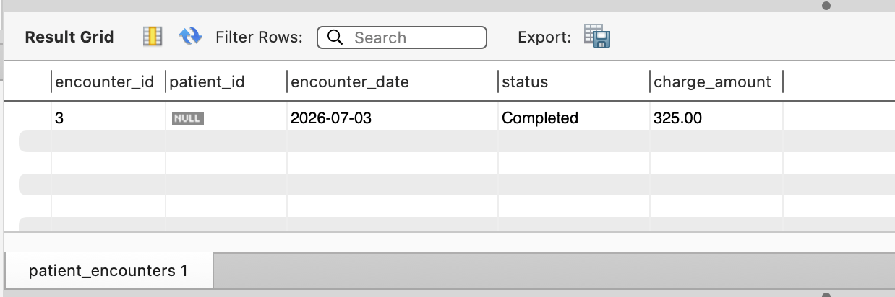
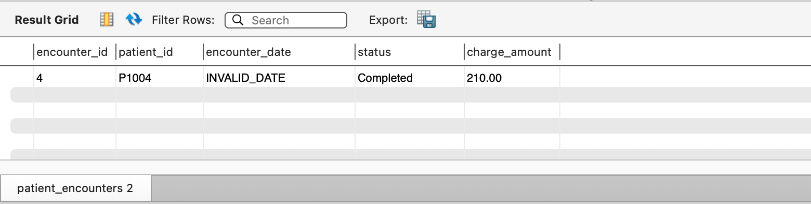
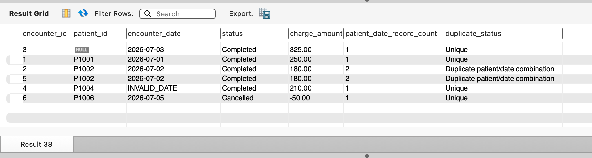
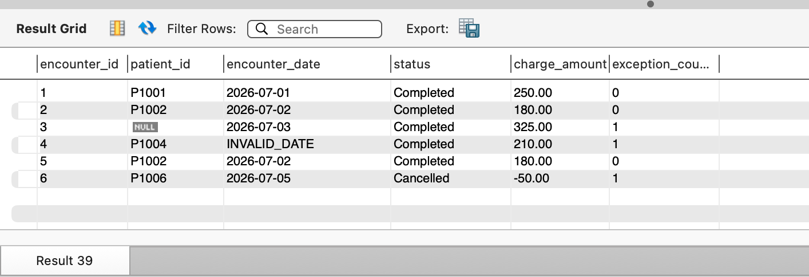
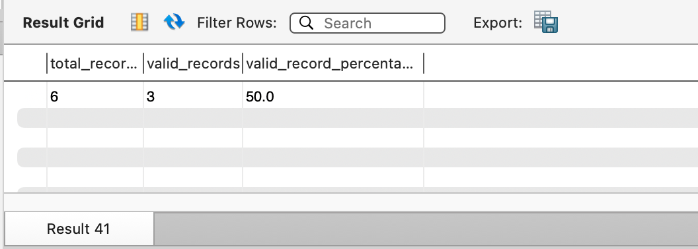

# 📊 Project Title: Healthcare Data Quality Assessment and Validation in MySQL

* **Project Type:** Healthcare SQL Portfolio
* **Industry:** Healthcare Analytics
* **Database:** MySQL 8
* **Development:** Environment: MySQL Workbench
* **Dataset:** Synthetic Healthcare Encounter Data

## Skills Demonstrated:
• SQL
• Data Validation
• Data Quality
• Business Rules
• Healthcare Analytics
• Technical Documentation

## 📝 Description
I created a healthcare encounter staging table in MySQL and wrote SQL validation queries to detect missing patient identifiers, duplicate patient-and-date combinations, invalid date formats, suspicious financial values, and operational totals. I documented the business rules and structured the exception queries so they could support reporting validation, implementation testing, or data-migration quality assurance.

## 🛠️ Tech Stack & Skills
* **Database:** MySQL (via MySQL Workbench)
* **Tools:** VS Code
* **SQL Skills:** Core SQL Skills

• SELECT
• WHERE
• GROUP BY
• HAVING
• Aggregate Functions
• CASE
• Window Functions
• COUNT()
• SUM()
• AVG()
• STR_TO_DATE()
• DATE_FORMAT()
• Data Validation
• Data Quality Assessment


## 🚀 Queries & Key Results

### 1. Create Database, Table, and Sample Data
* **Objective:** Create Table and DB to query Sample Data
* **SQL Code:**
```sql
CREATE DATABASE IF NOT EXISTS healthcare_data_quality;

USE healthcare_data_quality;

DROP TABLE IF EXISTS patient_encounters;

CREATE TABLE patient_encounters (
    encounter_id INT,
    patient_id VARCHAR(20),
    encounter_date VARCHAR(20),
    status VARCHAR(20),
    charge_amount DECIMAL(10, 2)
);

INSERT INTO patient_encounters (
    encounter_id,
    patient_id,
    encounter_date,
    status,
    charge_amount
)
VALUES
    (1, 'P1001', '2026-07-01', 'Completed', 250.00),
    (2, 'P1002', '2026-07-02', 'Completed', 180.00),
    (3, NULL,    '2026-07-03', 'Completed', 325.00),
    (4, 'P1004', 'INVALID_DATE', 'Completed', 210.00),
    (5, 'P1002', '2026-07-02', 'Completed', 180.00),
    (6, 'P1006', '2026-07-05', 'Cancelled', -50.00);
```
* **Output Result:**
<!--Place cursor below and paste your screenshot here -->


*Figure 1: Created the healthcare staging table and inserted sample encounter rows.*

### 2. Validation Rule 1: Patient ID must not be missing.

* **Objective:** Identifying missing or Null Patient IDs
* **SQL Code:**
```sql
SELECT *
FROM patient_encounters
WHERE patient_id IS NULL
   OR TRIM(patient_id) = '';
```
* **Output Result:**
<!-- Place cursor below and paste your screenshot here -->


*Figure 2: Found patient encounter rows where patient_id is missing or blank.*

### 3. Validation Rule 2: Patient and encounter-date combinations should not be duplicated.

* **Objective:** Identifying duplicate patient IDs and encounter date combinations
* **SQL Code:**
```sql
SELECT
    patient_id,
    encounter_date,
    COUNT(*) AS record_count
FROM patient_encounters
GROUP BY
    patient_id,
    encounter_date
HAVING COUNT(*) > 1;
```
* **Output Result:**

*Figure 3: Detected duplicate patient_id + encounter_date groups.*

### 4. Validation Rule 3: Charges Must be Positive, no negative or zero charges

* **Objective:** Identify Negative or Zero Charges
* **SQL Code:**
```sql
SELECT *
FROM patient_encounters
WHERE charge_amount <= 0;
```
* **Output Result:**
<!-- Place cursor below and paste your screenshot here -->


*Figure 4: Rows with invalid pricing values detected by the charge validation query.*

### 5. Validation Rule 4: Encounter dates must use an accepted YYYY-MM-DD date format. Any missing or misformatted date is Identified

* **Objective:** Identifying empty or misformatted dates
* **SQL Code:**
```sql
 SELECT *
FROM patient_encounters
WHERE encounter_date IS NULL
   OR STR_TO_DATE(encounter_date, '%Y-%m-%d') IS NULL;
   
SELECT *
FROM patient_encounters
WHERE encounter_date IS NULL
   OR STR_TO_DATE(encounter_date, '%Y-%m-%d') IS NULL
   OR DATE_FORMAT(
          STR_TO_DATE(encounter_date, '%Y-%m-%d'),
          '%Y-%m-%d'
      ) <> encounter_date;

SELECT * FROM patient_encounters;
```
* **Output Result:**
<!-- Place cursor below and paste your screenshot here -->

*Figure 5: Identified rows with invalid or improperly formatted encounter_date values.*

### 6. Validation Rule 5:  Generate Operational Summary Metrics by Encounter Status

* **Objective:** Summarize encounter volume, total charges, and average charges by encounter status. 
* **SQL Code:**
```sql
SELECT
    status,
    COUNT(*) AS encounter_count,
    SUM(charge_amount) AS total_charges
FROM patient_encounters
GROUP BY status
ORDER BY status;

SELECT
    status,
    COUNT(*) AS encounter_count,
    SUM(charge_amount) AS total_charges,
    ROUND(AVG(charge_amount), 2) AS average_charge
FROM patient_encounters
GROUP BY status
ORDER BY status;
```
* **Output Result:**
<!-- Place cursor below and paste your screenshot here -->

*Figure 6a: Status-level totals for charge amounts by encounter status.*


*Figure 6b: Status-level totals and average charge amounts for each status.*

### 7. Validation Rule 6: consolidates multiple data-quality rules into a single result set. It shows status, charge amounts, encounter_ids for those entries where there was a missing patient_id, negative charge amount, or invalid date formats

* **Objective:** This is an optional but valuable improvement. It consolidates multiple data-quality rules into a single result set. It shows status, charge amounts, encounter_ids for those entries where there was a missing patient_id, negative charge amount, or invalid date formats. It is a CASE statement

* **SQL Code:**
```sql
SELECT
    encounter_id,
    patient_id,
    encounter_date,
    status,
    charge_amount,
    CASE
        WHEN patient_id IS NULL OR TRIM(patient_id) = ''
            THEN 'Missing patient identifier'

        WHEN STR_TO_DATE(encounter_date, '%Y-%m-%d') IS NULL
            THEN 'Invalid encounter date'

        WHEN charge_amount <= 0
            THEN 'Invalid or suspicious charge'

        ELSE 'No exception detected'
    END AS validation_result
FROM patient_encounters
WHERE patient_id IS NULL
   OR TRIM(patient_id) = ''
   OR STR_TO_DATE(encounter_date, '%Y-%m-%d') IS NULL
   OR charge_amount <= 0
ORDER BY encounter_id;

```
* **Output Result:**
<!-- Place cursor below and paste your screenshot here -->

*Figure 7: Combined data quality exception results for missing ID, invalid date, or negative charge rows.*

### 8. Validation Rule 7: identifies two new columns patient_date_record_count and duplicate status, Unique or Duplicate Patient_id/Date Combination
* **Objective:** identifies two new columns patient_date_record_count and duplicate status, Unique or Duplicate Patient_id/Date Combination

* **SQL Code:**

```sql
SELECT
    encounter_id,
    patient_id,
    encounter_date,
    status,
    charge_amount,
    COUNT(*) OVER (
        PARTITION BY patient_id, encounter_date
    ) AS patient_date_record_count,
    CASE
        WHEN COUNT(*) OVER (
            PARTITION BY patient_id, encounter_date
        ) > 1
        THEN 'Duplicate patient/date combination'
        ELSE 'Unique'
    END AS duplicate_status
FROM patient_encounters;
```

* **Output Result:**
<!-- Place cursor below and paste your screenshot here -->


*Figure 8: Full dataset rows annotated with duplicate group counts and validation status.* 

### 9. Exception Count for Each Record

* **Objective:** This metric provides a concise indication of whether a source dataset is ready for reporting, migration, or additional remediation.

* **SQL Code:**

```sql
SELECT
    encounter_id,
    patient_id,
    encounter_date,
    status,
    charge_amount,
    (
        CASE
            WHEN patient_id IS NULL OR TRIM(patient_id) = ''
            THEN 1 ELSE 0
        END
        +
        CASE
            WHEN STR_TO_DATE(encounter_date, '%Y-%m-%d') IS NULL
            THEN 1 ELSE 0
        END
        +
        CASE
            WHEN charge_amount <= 0
            THEN 1 ELSE 0
        END
    ) AS exception_count
FROM patient_encounters
ORDER BY encounter_id;
```

* **Output Result:**

<!-- Place cursor below and paste your screenshot here -->


*Figure 9: Each encounter row with a count of exceptions (missing ID, invalid date, or invalid charge).*


### 10. Calculate the Overall Valid-Record Rate and Valid Record Percentage

* **Objective:** This metric provides insight into the validity and completeness of the sample data as a percentage. In other words, this query provides the percentage of complete data entries out of all data entries.

* **SQL Code:**

```sql
SELECT
    COUNT(*) AS total_records,
    SUM(
        CASE
            WHEN patient_id IS NOT NULL
             AND TRIM(patient_id) <> ''
             AND STR_TO_DATE(encounter_date, '%Y-%m-%d') IS NOT NULL
             AND charge_amount > 0
            THEN 1
            ELSE 0
        END
    ) AS valid_records,
    ROUND(
        100.0 * SUM(
            CASE
                WHEN patient_id IS NOT NULL
                 AND TRIM(patient_id) <> ''
                 AND STR_TO_DATE(encounter_date, '%Y-%m-%d') IS NOT NULL
                 AND charge_amount > 0
                THEN 1
                ELSE 0
            END
        ) / COUNT(*),
        1
    ) AS valid_record_percentage
FROM patient_encounters;
```

* **Output Result:**

<!-- Place cursor below and paste your screenshot here -->


*Figure 10: Aggregate summary showing total records, valid record count, and valid record percentage.*

## Data-Quality Summary

Three of six encounter records passed all completeness, date-validity,
and financial-validity checks, resulting in a 50.0% valid-record rate.

This metric provides a concise indication of whether a source dataset is
ready for reporting, migration, or additional remediation.

## Key Findings

• One patient encounter contained a missing patient identifier.

• One duplicate patient/date combination was identified.

• One encounter contained an invalid date format.

• One cancelled encounter contained a negative charge.

• Completed encounters accounted for five of six encounters.

• Total completed encounter charges equaled $1,145.00.

## Business Impact

These validation rules help improve:

• Data completeness

• Financial reporting accuracy

• Operational reporting reliability

• Data migration readiness

• Healthcare implementation testing

• Dashboard quality

• Downstream analytics confidence

## Future Enhancements

Potential next steps include:

• Loading encounter data from CSV files

• Creating stored procedures for recurring validation

• Automating validation reports with scheduled jobs

• Building Power BI dashboards from the validated dataset

• Expanding the model with provider, payer, diagnosis, and procedure tables