# 📊 Project Title: Healthcare Revenue Cycle

* **Project Type:** Healthcare SQL and Revenue Cycle Analytics Portfolio Project
* **Industry:** Healthcare Analytics
* **Database:** MySQL 8 and VS Code (ERD Editor Extension)
* **Development:** Environment: MySQL Workbench
* **Dataset:** Synthetic patients, insurance plans, providers, claims, and payment data
* **Data Modeling:** Entity-Relationship Diagram (ERD) created with ERD Editor in Visual Studio Code
* **Data Model:** Relational database with primary and foreign keys
* **Primary Focus:** Claims performance, denials, reimbursement, payment reconciliation, and revenue-cycle data quality

## Skills Demonstrated:
• SQL
• Data Summary
• Relational
• Data Quality
• Business Rules
• Healthcare Analytics
• Technical Documentation

## 📝 Project Description
I designed and implemented a relational healthcare revenue-cycle database in MySQL containing patient, insurance-plan, provider, claim, and payment data. Used primary and foreign keys to model relationships among patients, payers, rendering providers, submitted claims, and remittances.
Developed SQL analyses to measure claim volume, billed and allowed amounts, denial rates, reimbursement performance, payer and provider trends, submission delays, outstanding balances, and payment discrepancies. Created validation queries to identify inconsistent claim statuses, missing payments, impossible financial values, and other exceptions that could impair reporting or revenue-cycle operations.
The project culminates in a reusable SQL view that consolidates clinical, payer, claim, and payment information for dashboard development and recurring revenue-cycle reporting.

## 🛠️ Tech Stack & Skills
* **Database:** MySQL (via MySQL Workbench)
* **Tools:** MySQL WorkBench and VS Code (ERD Editor) and creation of this .md file
• SELECT
• WHERE
• GROUP BY
• HAVING
• Aggregate Functions
• CASE
• Window Functions
• COUNT()
• SUM()
• AVG()
• INNER JOIN
• LEFT JOIN
• COALESCE
• Data Validation
• Data Quality Assessment


## 🚀 Queries & Key Results

### 1. Create the Database, Tables, and Relationships Represented in the ERD
*Figure 1: Entity-Relationship Diagram showing the relationships among patients, providers, insurance plans, claims, and payments.*
<!--Place cursor below and paste your screenshot here -->
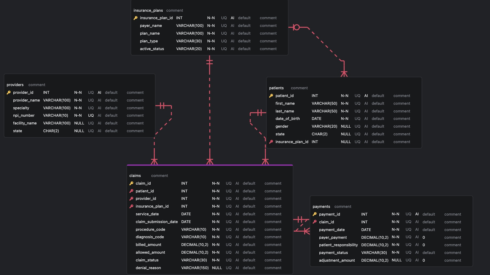

* **Objective:** Create database, tables, and insert synthetic datasets to query and report business implications
* **SQL Code:*
```sql
DROP DATABASE IF EXISTS healthcare_revenue_cycle;

CREATE DATABASE healthcare_revenue_cycle;

USE healthcare_revenue_cycle;


CREATE TABLE claims
(
  claim_id              INT           NOT NULL,
  patient_id            INT           NOT NULL,
  provider_id           INT           NOT NULL,
  insurance_plan_id     INT           NOT NULL,
  service_date          DATE          NOT NULL,
  claim_submission_date DATE          NOT NULL,
  procedure_code        VARCHAR(10)   NOT NULL,
  diagnosis_code        VARCHAR(10)   NOT NULL,
  billed_amount         DECIMAL(10,2) NOT NULL,
  allowed_amount        DECIMAL(10,2) NOT NULL,
  claim_status          VARCHAR(30)   NOT NULL,
  denial_reason         VARCHAR(150)  NULL    ,
  PRIMARY KEY (claim_id)
);

CREATE TABLE insurance_plans
(
  insurance_plan_id INT          NOT NULL AUTO_INCREMENT,
  payer_name        VARCHAR(100) NOT NULL,
  plan_name         VARCHAR(100) NOT NULL,
  plan_type         VARCHAR(30)  NOT NULL,
  active_status     VARCHAR(20)  NOT NULL,
  PRIMARY KEY (insurance_plan_id)
);

CREATE TABLE patients
(
  patient_id        INT         NOT NULL AUTO_INCREMENT,
  first_name        VARCHAR(50) NOT NULL,
  last_name         VARCHAR(50) NOT NULL,
  date_of_birth     DATE        NOT NULL,
  gender            VARCHAR(20) NULL    ,
  state             CHAR(2)     NULL    ,
  insurance_plan_id INT         NULL    ,
  PRIMARY KEY (patient_id)
);

CREATE TABLE payments
(
  payment_id             INT           NOT NULL AUTO_INCREMENT,
  claim_id               INT           NOT NULL,
  payment_date           DATE          NOT NULL,
  payer_payment          DECIMAL(10,2) NOT NULL DEFAULT 0,
  patient_responsibility DECIMAL(10,2) NOT NULL DEFAULT 0,
  payment_status         VARCHAR(30)   NOT NULL,
  adjustment_amount      DECIMAL(10,2) NULL     DEFAULT 0,
  PRIMARY KEY (payment_id)
);

CREATE TABLE providers
(
  provider_id   INT          NOT NULL AUTO_INCREMENT,
  provider_name VARCHAR(100) NOT NULL,
  specialty     VARCHAR(100) NOT NULL,
  npi_number    VARCHAR(10)  NOT NULL,
  facility_name VARCHAR(100) NULL    ,
  state         CHAR(2)      NULL    ,
  PRIMARY KEY (provider_id)
);

ALTER TABLE providers
  ADD CONSTRAINT UQ_npi_number UNIQUE (npi_number);

ALTER TABLE patients
  ADD CONSTRAINT FK_insurance_plans_TO_patients
    FOREIGN KEY (insurance_plan_id)
    REFERENCES insurance_plans (insurance_plan_id);

ALTER TABLE claims
  ADD CONSTRAINT FK_insurance_plans_TO_claims
    FOREIGN KEY (insurance_plan_id)
    REFERENCES insurance_plans (insurance_plan_id);

ALTER TABLE payments
  ADD CONSTRAINT FK_claims_TO_payments
    FOREIGN KEY (claim_id)
    REFERENCES claims (claim_id);

ALTER TABLE claims
  ADD CONSTRAINT FK_patients_TO_claims
    FOREIGN KEY (patient_id)
    REFERENCES patients (patient_id);

ALTER TABLE claims
  ADD CONSTRAINT FK_providers_TO_claims
    FOREIGN KEY (provider_id)
    REFERENCES providers (provider_id);

```
* **Output Result:** There is no visual result, except the action output which tells us if our SQL code was successful or not
<!--Place cursor below and paste your screenshot here -->


### 2. Insert data into tables and view tables: 

* **Objective:** Enter synthetic datasets into each table and view each table. I will enter data into one table at a time then display each
* **SQL Code:** 
*Entering insurance_plans data
```sql
INSERT INTO insurance_plans (
    insurance_plan_id,
    payer_name,
    plan_name,
    plan_type,
    active_status
)
VALUES
    (1, 'Horizon Blue Cross', 'Horizon Advantage', 'PPO', 'Active'),
    (2, 'UnitedHealthcare', 'Choice Plus', 'PPO', 'Active'),
    (3, 'Medicare', 'Medicare Part B', 'Medicare', 'Active');

SELECT * FROM insurance plans;
```
* **Output Result:** insurance plans table
<!--Place cursor below and paste your screenshot here -->
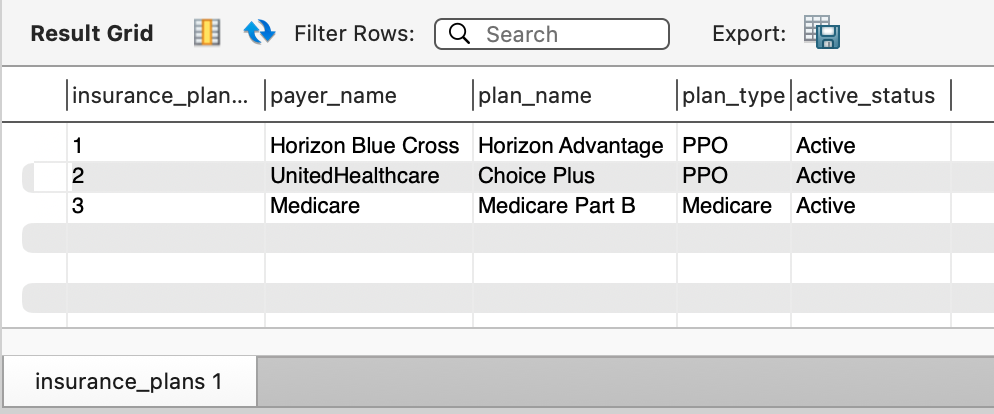

_Figure 2: Insurance plans table showing inserted payer records, plan types, and active status._

* **SQL Code:** Entering patients table data
```sql
INSERT INTO patients (
    patient_id,
    first_name,
    last_name,
    date_of_birth,
    gender,
    state,
    insurance_plan_id
)
VALUES
    (1, 'Maria', 'Lopez', '1982-04-17', 'Female', 'NJ', 1),
    (2, 'James', 'Carter', '1975-09-02', 'Male', 'NY', 2),
    (3, 'Aisha', 'Patel', '1990-12-11', 'Female', 'PA', 1),
    (4, 'Robert', 'Green', '1968-06-25', 'Male', 'NJ', 3),
    (5, 'Emily', 'Chen', '1988-03-14', 'Female', 'NY', 2);

SELECT * FROM patients;
```
* **Output Result:** patients table
<!--Place cursor below and paste your screenshot here -->
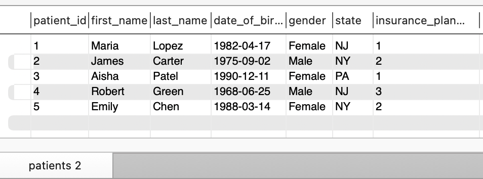

_Figure 2: Patients table showing inserted patient demographics, state, and insurance plan assignments._

* **SQL Code:** Entering providers table data
```sql
INSERT INTO providers (
    provider_id,
    provider_name,
    specialty,
    npi_number,
    facility_name,
    state
)
VALUES
    (
        1,
        'Dr. Susan Miller',
        'Cardiology',
        '1234567890',
        'Northside Medical Center',
        'NJ'
    ),
    (
        2,
        'Dr. Daniel Kim',
        'Primary Care',
        '2345678901',
        'Metro Health Clinic',
        'NY'
    ),
    (
        3,
        'Dr. Rachel Evans',
        'Orthopedics',
        '3456789012',
        'Valley Specialty Group',
        'PA'
    );

SELECT * FROM providers;
```
* **Output Result:** providers table
<!--Place cursor below and paste your screenshot here -->
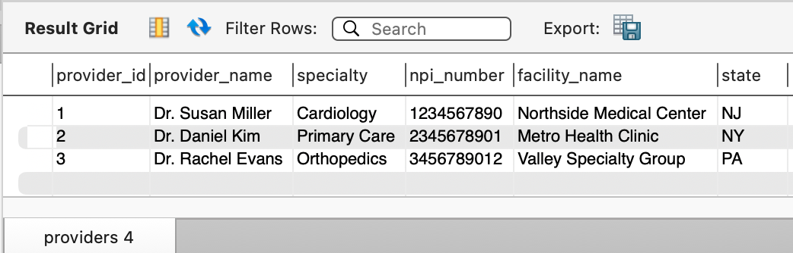

_Figure 3: Providers table showing inserted provider details, specialties, facility assignments, and NPI numbers._


* **SQL Code:** Entering claims table data
```sql
INSERT INTO claims (
    claim_id,
    patient_id,
    provider_id,
    insurance_plan_id,
    service_date,
    claim_submission_date,
    procedure_code,
    diagnosis_code,
    billed_amount,
    allowed_amount,
    claim_status,
    denial_reason
)
VALUES
    (
        1001,
        1,
        1,
        1,
        '2026-06-01',
        '2026-06-03',
        '99214',
        'I10',
        300.00,
        220.00,
        'Paid',
        NULL
    ),
    (
        1002,
        2,
        2,
        2,
        '2026-06-05',
        '2026-06-06',
        '99213',
        'E11.9',
        180.00,
        135.00,
        'Paid',
        NULL
    ),
    (
        1003,
        3,
        3,
        1,
        '2026-06-08',
        '2026-06-10',
        '73560',
        'M25.561',
        450.00,
        320.00,
        'Denied',
        'Missing authorization'
    ),
    (
        1004,
        4,
        1,
        3,
        '2026-06-12',
        '2026-06-13',
        '93000',
        'I48.91',
        225.00,
        160.00,
        'Pending',
        NULL
    ),
    (
        1005,
        5,
        2,
        2,
        '2026-06-15',
        '2026-06-18',
        '99214',
        'J06.9',
        275.00,
        200.00,
        'Denied',
        'Invalid diagnosis code'
    ),
    (
        1006,
        1,
        1,
        1,
        '2026-06-20',
        '2026-06-21',
        '93306',
        'I10',
        800.00,
        600.00,
        'Paid',
        NULL
    );
SELECT * FROM claims;
```
* **Output Result:** claims table
<!--Place cursor below and paste your screenshot here -->
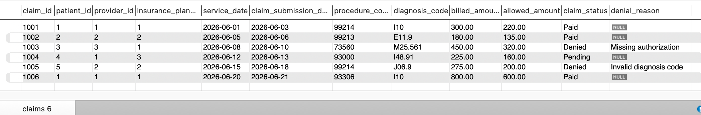

_Figure 4: Claims table showing the inserted claim records, billed and allowed amounts, submission dates, and claim statuses._

* **SQL Code:** Entering payments data
```sql
INSERT INTO payments (
    payment_id,
    claim_id,
    payment_date,
    payer_payment,
    patient_responsibility,
    payment_status,
    adjustment_amount
)
VALUES
    (
        5001,
        1001,
        '2026-06-20',
        180.00,
        40.00,
        'Paid',
        80.00
    ),
    (
        5002,
        1002,
        '2026-06-22',
        110.00,
        25.00,
        'Paid',
        45.00
    ),
    (
        5003,
        1006,
        '2026-07-05',
        500.00,
        100.00,
        'Paid',
        200.00
    );

SELECT * FROM payments;
```
* **Output Result:** payments table
<!--Place cursor below and paste your screenshot here -->
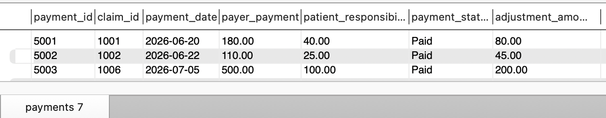

_Figure 5: Payments table showing payer payment, patient responsibility, adjustments, and payment statuses._

* Show ALL Tables (names)
```sql
SHOW TABLES;
```
* **Output Result:** All tables by name
<!--Place cursor below and paste your screenshot here -->
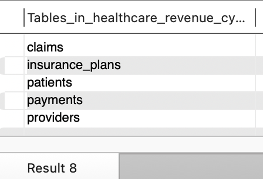

_Figure 6: Database schema listing all created tables in the healthcare revenue cycle project._


### 3. View the complete claims dataset using joins

* **Objective:** View the complete claims dataset using joins. This is the first major relational query, but the objective
is to see a complete dataset using INNER JOINS
* **SQL Code:**
```sql
SELECT
    c.claim_id,
    CONCAT(pay.first_name, ' ', pay.last_name) AS patient_name,
    pr.provider_name,
    pr.specialty,
    ip.payer_name,
    ip.plan_name,
    c.service_date,
    c.procedure_code,
    c.diagnosis_code,
    c.billed_amount,
    c.allowed_amount,
    c.claim_status,
    c.denial_reason
FROM claims AS c
INNER JOIN patients AS p
    ON c.patient_id = pay.patient_id
INNER JOIN providers AS pr
    ON c.provider_id = pr.provider_id
INNER JOIN insurance_plans AS ip
    ON c.insurance_plan_id = ip.insurance_plan_id
ORDER BY c.claim_id;
```
* **Output Result:** insurance plans table
<!--Place cursor below and paste your screenshot here -->
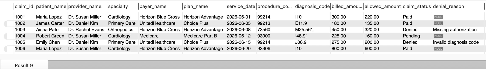

_Figure 7: Result set showing the complete joined claims dataset across patients, providers, and payers._

### 4. Find Denied Claims: 

* **Objective:** Identify denied claims
* **SQL Code:** 
```sql
SELECT
    claim_id,
    patient_id,
    provider_id,
    billed_amount,
    allowed_amount,
    denial_reason
FROM claims
WHERE claim_status = 'Denied';
```
* **Output Result:** denied claims where the claim status is listed as 'Denied'.
<!--Place cursor below and paste your screenshot here -->
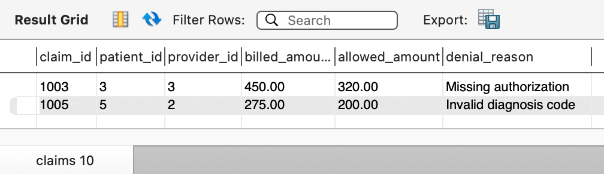


_Figure 8: Denied claims result set showing claim IDs, patient/provider references, billed and allowed amounts, and denial reasons._

### 5. Count all claims by claim status: 

* **Objective:** Count claims by their status
* **SQL Code:** 
```sql
SELECT
	claim_status,
	COUNT(*) AS claim_count
FROM claims
GROUP BY claim_status
ORDER BY claim_status
```
* **Output Result:** count claims via status
<!--Place cursor below and paste your screenshot here -->
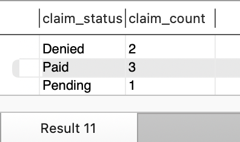

_Figure 9: Claim count grouped by claim status, illustrating paid, denied, and pending volumes._

### 6. Calculate total billed and allowed amounts: 

* **Objective:** To identify total billed and total allowed amounts
* **SQL Code:** 
```sql
SELECT
	SUM(billed_amount) AS total_billed_amount,
	SUM(allowed_amount) AS total_allowed_amount
FROM claims;
```
* **Output Result:** 
<!--Place cursor below and paste your screenshot here -->
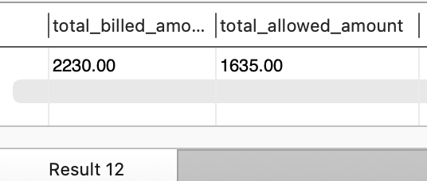


_Figure 10: Total billed amount versus total allowed amount across the full claims dataset._

### 7. Calculate amounts by claim status: 

* **Objective:** Calculate billed and allowed amounts by claim status
* **SQL Code:** 
```sql
SELECT
	claim_status,
	COUNT(*) AS claim_count,
	SUM(billed_amount) AS total_billed,
	SUM(allowed_amount) AS total_allowed,
	ROUND(AVG(billed_amount),2) AS average_billed
FROM claims
GROUP BY claim_status
ORDER BY claim_status;

```
* **Output Result:** 
<!--Place cursor below and paste your screenshot here -->
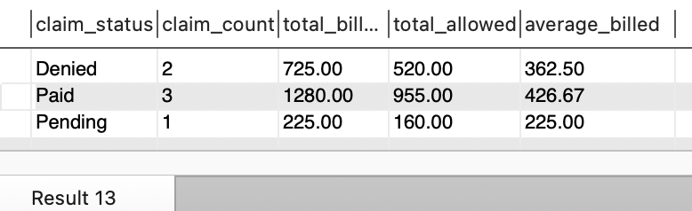

_Figure 11: Billed and allowed amounts summarized by claim status, highlighting differences across paid, denied, and pending claims._

### 8. Calculate the denial rate: 

* **Objective:** Calculate the denial rate percentage of all claims
* **SQL Code:** 
```sql
SELECT
	COUNT(*) AS total_claims,
	SUM(
		CASE
			WHEN claim_status = 'Denied' THEN 1 ELSE 0
		END
	) AS denied_claims,
	ROUND(
		100 * SUM(
			CASE
				WHEN claim_status = 'Denied' THEN 1 ELSE 0
			END
		) / COUNT(*),
		1 
		) AS denial_rate_percentage
	FROM claims;
```
* **Output Result:** 
<!--Place cursor below and paste your screenshot here -->
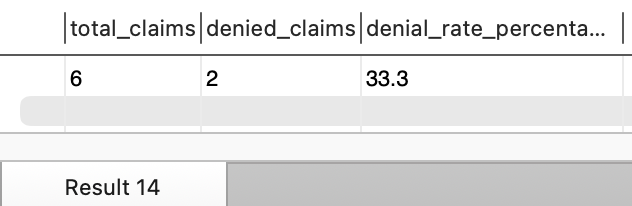

_Figure 12: Denial rate percentage for the claims dataset, calculated as denied claims over total claims._

### 9. Compare billed and allowed amounts and the percentage total allowed of total billed: 

* **Objective:** Compare billed and allowed amounts and the percentage total allowed of total billed
* **SQL Code:** 
```sql
SELECT 
	claim_id,
	billed_amount,
	allowed_amount, 
	billed_amount - allowed_amount AS contractual_difference,
	ROUND(
		100.0 * allowed_amount / billed_amount,
		1
	) AS allowed_percentage
FROM claims
ORDER BY claim_id;	
```
* **Output Result:** 
<!--Place cursor below and paste your screenshot here -->
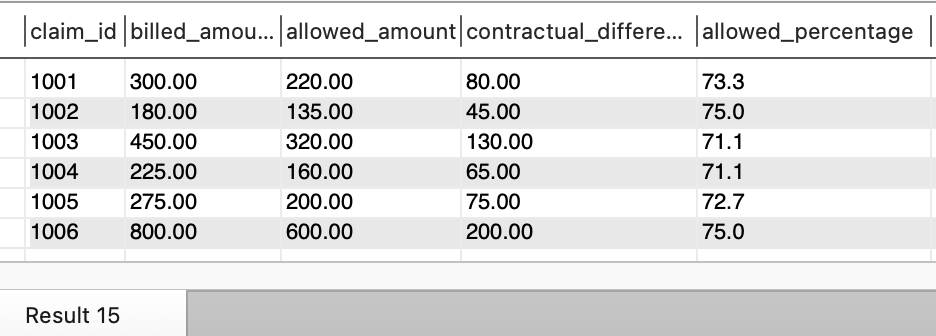

_Figure 13: Allowed amount as a percentage of billed amount for each claim, showing contractual write-offs and payment take-rates._

### 10. Summarize claims by payer and total allowed by each payer: 

* **Objective:** Identify total amount allowed by payer name
* **SQL Code:** 
```sql
SELECT
	ip.payer_name,
	COUNT(c.claim_id) AS claim_count,
	SUM(c.billed_amount) AS total_billed,
	SUM(c.allowed_amount) AS total_allowed,
	ROUND(AVG(c.allowed_amount),2) AS average_allowed
FROM claims AS c
INNER JOIN insurance_plans AS ip
	ON c.insurance_plan_id = ip.insurance_plan_id
GROUP BY ip.payer_name
ORDER BY total_allowed DESC;
```
* **Output Result:** 
<!--Place cursor below and paste your screenshot here -->
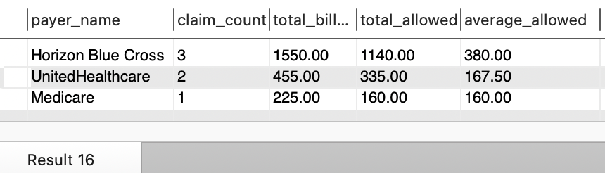

_Figure 14: Total allowed amount summarized by payer, identifying payer share of allowed reimbursement._

### 11. Summarize: Summarize total amount allowed by provider

* **Objective:** Summarize total amount allowed by provider (name, specialty, and provider_id)
* **SQL Code:** 
```sql
SELECT
	pr.provider_name,
	pr.specialty,
	COUNT(c.claim_id) AS claim_count,
	SUM(c.billed_amount) AS total_billed,
	SUM(c.allowed_amount) AS total_allowed
FROM claims AS c
INNER JOIN providers AS pr
	ON c.provider_id = pr.provider_id
GROUP BY
	pr.provider_id,
	pr.provider_name,
	pr.specialty
ORDER BY total_billed DESC;

```
* **Output Result:** 
<!--Place cursor below and paste your screenshot here -->
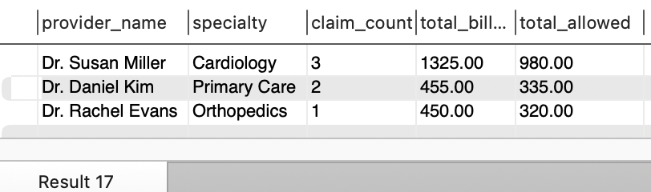

_Figure 15: Total billed amounts summarized by provider, showing provider revenue contributions and service volumes._

### 12: Reconcile paid claims with payments: 

* **Objective:** Confirm that each paid claim is financially balanced. The payer payment plus patient responsibility should equal the allowed amount, while the adjustment should equal the difference between billed and allowed amounts.
* **SQL Code:** 
```sql
SELECT
    c.claim_id,
    c.billed_amount,
    c.allowed_amount,
    pay.payer_payment,
    pay.patient_responsibility,
    pay.adjustment_amount,

    pay.payer_payment + pay.patient_responsibility
        AS total_reimbursement,

    c.allowed_amount
        - (pay.payer_payment + pay.patient_responsibility)
        AS allowed_balance,

    c.billed_amount - c.allowed_amount
        AS expected_adjustment,

    (c.billed_amount - c.allowed_amount)
        - pay.adjustment_amount
        AS adjustment_variance,

    CASE
        WHEN c.allowed_amount =
             pay.payer_payment + pay.patient_responsibility
         AND c.billed_amount - c.allowed_amount =
             pay.adjustment_amount
            THEN 'Fully reconciled'
        ELSE 'Reconciliation exception'
    END AS reconciliation_status

FROM claims AS c
INNER JOIN payments AS pay
    ON c.claim_id = pay.claim_id
WHERE c.claim_status = 'Paid'
ORDER BY c.claim_id; 
```
* **Output Result:** 
<!--Place cursor below and paste your screenshot here -->
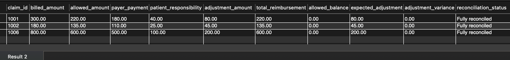

_Figure 16: Reconciliation status for paid claims, verifying that total reimbursement matches allowed amounts and adjustment expectations._

### 13: Find paid claims without payment records: 

* **Objective:** Identify claims marked Paid that do not have a corresponding record in the payments table.
* **SQL Code:** 
```sql
SELECT
    c.claim_id,
    CONCAT(p.first_name, ' ', p.last_name) AS patient_name,
    c.allowed_amount,
    c.claim_status
FROM claims AS c
INNER JOIN patients AS p
    ON c.patient_id = p.patient_id
LEFT JOIN payments AS pay
    ON c.claim_id = pay.claim_id
WHERE c.claim_status = 'Paid'
  AND pay.payment_id IS NULL;
```
* **Output Result:** No rows. All three paid claims have payment records.
A zero-row result is useful: it demonstrates that the validation passed.
<!--Place cursor below and paste your screenshot here -->


### 14. Find payments associated with nonpaid claims: 

* **Objective:** Identify payments attached to claims that remain Pending or Denied.
* **SQL Code:** 
```sql
SELECT
    pay.payment_id,
    pay.claim_id,
    c.claim_status,
    pay.payer_payment,
    pay.patient_responsibility,
    pay.adjustment_amount
FROM payments AS pay
INNER JOIN claims AS c
    ON pay.claim_id = c.claim_id
WHERE c.claim_status <> 'Paid';
```
* **Output Result:** Expected output -> No rows. Every payment record is associated with a paid claim.
<!--Place cursor below and paste your screenshot here -->


### 15. Validate denial documentation: 

* **Objective:** Identify denied claims that do not have a documented denial reason.
* **SQL Code:** 
```sql
SELECT
    claim_id,
    patient_id,
    provider_id,
    claim_status,
    denial_reason
FROM claims
WHERE claim_status = 'Denied'
  AND (
        denial_reason IS NULL
        OR TRIM(denial_reason) = ''
      );
```
* **Output Result:** Expected output: No rows. Both denied claims have denial reasons.
<!--Place cursor below and paste your screenshot here -->
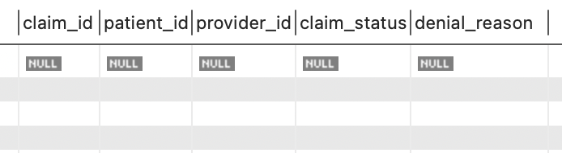

_Figure 17: Denied claims that would require follow-up due to missing or blank denial reason documentation._

### 16. Summarize denials by reason: 

* **Objective:** Determine the number and financial value of claims associated with each denial reason.
* **SQL Code:** 
```sql
SELECT
    denial_reason,
    COUNT(*) AS denied_claim_count,
    SUM(billed_amount) AS denied_billed_amount,
    SUM(allowed_amount) AS denied_allowed_amount
FROM claims
WHERE claim_status = 'Denied'
GROUP BY denial_reason
ORDER BY denied_billed_amount DESC;
```
* **Output Result:** 
<!--Place cursor below and paste your screenshot here -->
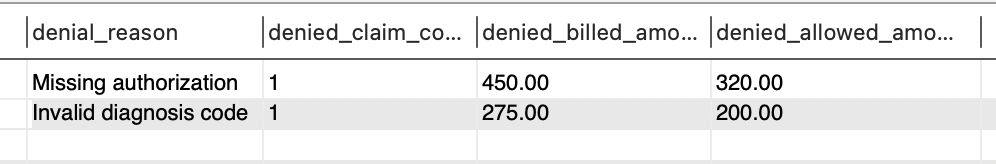

_Figure 18: Denied billed amount grouped by denial reason, supporting root-cause analysis for denials._

### 17: Calculate denied-dollar rate.  

* **Objective:** Measure the percentage of total billed charges associated with denied claims.
* **SQL Code:** 
```sql
SELECT
    SUM(billed_amount) AS total_billed_amount,

    SUM(
        CASE
            WHEN claim_status = 'Denied'
                THEN billed_amount
            ELSE 0
        END
    ) AS denied_billed_amount,

    ROUND(
        100.0 * SUM(
            CASE
                WHEN claim_status = 'Denied'
                    THEN billed_amount
                ELSE 0
            END
        ) / SUM(billed_amount),
        1
    ) AS denied_dollar_rate_percentage

FROM claims;
```
* **Output Result:** This is different from the claim-count denial rate of 33.3%.
<!--Place cursor below and paste your screenshot here -->
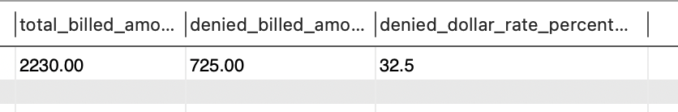

_Figure 19: Denied dollar rate percentage in the portfolio dataset, showing denied billed charges as a share of total billed charges._

### 18. Analyze claim-submission lag 

* **Objective:** Calculate the number of days between the service date and claim-submission date.
* **SQL Code:** 
```sql
SELECT
    claim_id,
    service_date,
    claim_submission_date,

    DATEDIFF(
        claim_submission_date,
        service_date
    ) AS submission_lag_days,

    CASE
        WHEN DATEDIFF(
            claim_submission_date,
            service_date
        ) > 2
            THEN 'Submission follow-up'
        ELSE 'Submitted within 2 days'
    END AS submission_status

FROM claims
ORDER BY submission_lag_days DESC, claim_id;
```
* **Output Result:** The two-day threshold is a project-defined operational benchmark, not a regulatory filing limit.
<!--Place cursor below and paste your screenshot here -->
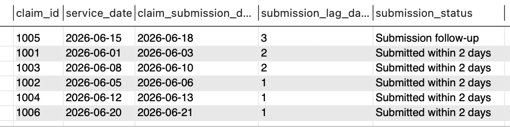!

_Figure 20: Claim service date versus submission date lag, highlighting submission timeliness and possible follow-up cases._

### 19. Summarize submission performance: 

* **Objective:** Calculate the average and maximum claim-submission lag and count claims exceeding the project’s two-day threshold.
* **SQL Code:** 
```sql
SELECT
    COUNT(*) AS total_claims,

    ROUND(
        AVG(
            DATEDIFF(
                claim_submission_date,
                service_date
            )
        ),
        2
    ) AS average_submission_lag_days,

    MAX(
        DATEDIFF(
            claim_submission_date,
            service_date
        )
    ) AS maximum_submission_lag_days,

    SUM(
        CASE
            WHEN DATEDIFF(
                claim_submission_date,
                service_date
            ) > 2
                THEN 1
            ELSE 0
        END
    ) AS claims_over_two_days

FROM claims;
```
* **Output Result:** 
<!--Place cursor below and paste your screenshot here -->
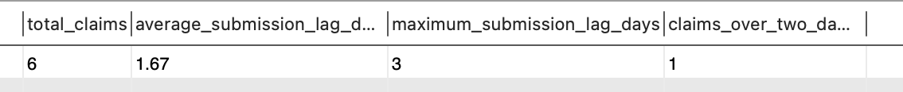

_Figure 21: Average and maximum claim submission lag summary, including counts of claims exceeding the two-day benchmark._

### 20. Identify patients with multiple claims: 

* **Objective:** Identify patients with repeated utilization and summarize their billed and allowed amounts.
* **SQL Code:** 
```sql
SELECT
    pt.patient_id,
    CONCAT(pt.first_name, ' ', pt.last_name) AS patient_name,
    COUNT(c.claim_id) AS claim_count,
    SUM(c.billed_amount) AS total_billed,
    SUM(c.allowed_amount) AS total_allowed
FROM patients AS pt
INNER JOIN claims AS c
    ON pt.patient_id = c.patient_id
GROUP BY 
    pt.patient_id,
    pt.first_name,
    pt.last_name
HAVING COUNT(c.claim_id) > 1
ORDER BY claim_count DESC, total_billed; 
```
* **Output Result:** 
<!--Place cursor below and paste your screenshot here -->
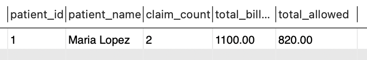

_Figure 22: Patients with multiple claims and aggregated billed/allowed amounts, indicating repeat utilization patterns._

### 21. Analyze claims by procedure code 

* **Objective:** Compare claim volume, billed amounts, allowed amounts, and denial performance across procedures.
* **SQL Code:** 
```sql
SELECT
    procedure_code,
    COUNT(*) AS claim_count,
    SUM(billed_amount) AS total_billed,
    SUM(allowed_amount) AS total_allowed,
    
    SUM(
        CASE
            WHEN claim_status = 'Denied' THEN 1 ELSE 0
        END
    ) AS denied_claims,

    ROUND(
        100 * SUM(
            CASE
                WHEN claim_status = 'Denied' THEN 1 ELSE 0
            END
        ) / COUNT(*),
        1
    ) AS denial_rate_percentage
FROM claims
GROUP BY procedure_code
ORDER BY total_billed;

```
* **Output Result:** 
 #### Procedure 99214 has:
 * Two claims
 * $575 billed
 * $420 allowed
 * One denied claim
 * 50.0% denial rate
<!--Place cursor below and paste your screenshot here -->
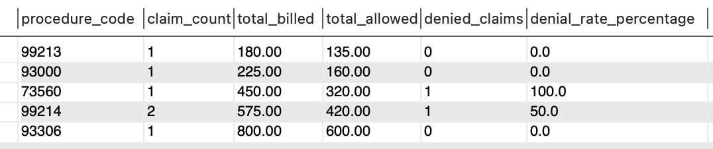

_Figure 23: Claims analysis by procedure code, comparing volume, billed amounts, allowed amounts, and denial rates._

### 22: Analyze claims by diagnosis code 

* **Objective:** Compare claim volume and financial performance across diagnosis codes.
* **SQL Code:** 
```sql
SELECT
    diagnosis_code,
    COUNT(*) AS claim_count,
    SUM(billed_amount) AS total_billed,
    SUM(allowed_amount) AS total_allowed,

    SUM(
        CASE
            WHEN claim_status = 'Denied' THEN 1
            ELSE 0
        END
    ) AS denied_claims

FROM claims
GROUP BY diagnosis_code
ORDER BY total_billed DESC; 
```
* **Output Result:** 
    #### Diagnosis I10 
    * Two claims
    * $1,100 billed
    * $820 allowed
    * Zero denied claims
<!--Place cursor below and paste your screenshot here -->
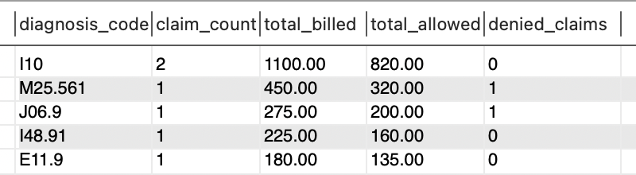

_Figure 24: Claims analysis by diagnosis code, summarizing financials and claim volume by diagnosis category._

### 23. Calculate payment turnaround time: 

* **Objective:** Measure how many days elapsed between claim submission and payment.
* **SQL Code:** 
```sql
SELECT
    c.claim_id,
    CONCAT(pt.first_name, ' ', pt.last_name) AS patient_name,
    c.claim_submission_date,
    p.payment_date,

    DATEDIFF(
        p.payment_date,
        c.claim_submission_date
    ) AS days_from_submission_to_payment

FROM claims AS c
INNER JOIN patients AS pt
    ON c.patient_id = pt.patient_id
INNER JOIN payments AS p
    ON c.claim_id = p.claim_id
WHERE c.claim_status = 'Paid'
ORDER BY days_from_submission_to_payment DESC;
```
* **Output Result:**

<table border="1" cellspacing="0" cellpadding="8" style="border-collapse: collapse; width: 100%;">
  <thead>
    <tr>
      <th style="border: 1px solid #666; padding: 8px; text-align: left;">Claim</th>
      <th style="border: 1px solid #666; padding: 8px; text-align: left;">Patient</th>
      <th style="border: 1px solid #666; padding: 8px; text-align: left;">Payment turnaround</th>
    </tr>
  </thead>
  <tbody>
    <tr>
      <td style="border: 1px solid #666; padding: 8px; text-align: left;">1001</td>
      <td style="border: 1px solid #666; padding: 8px; text-align: left;">Maria Lopez</td>
      <td style="border: 1px solid #666; padding: 8px; text-align: left;">17 days</td>
    </tr>
    <tr>
      <td style="border: 1px solid #666; padding: 8px; text-align: left;">1002</td>
      <td style="border: 1px solid #666; padding: 8px; text-align: left;">James Carter</td>
      <td style="border: 1px solid #666; padding: 8px; text-align: left;">16 days</td>
    </tr>
    <tr>
      <td style="border: 1px solid #666; padding: 8px; text-align: left;">1006</td>
      <td style="border: 1px solid #666; padding: 8px; text-align: left;">Maria Lopez</td>
      <td style="border: 1px solid #666; padding: 8px; text-align: left;">14 days</td>
    </tr>
  </tbody>
</table>

<!--Place cursor below and paste your screenshot here -->
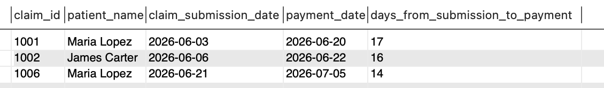

_Figure 25: Payment turnaround time from submission to payment, demonstrating the speed of cash application for paid claims._


### 24: Summarize payment components 

* **Objective:** Calculate total payer payments, patient responsibility, contractual adjustments, and total reimbursement.
* **SQL Code:** 
```sql
SELECT
    COUNT(*) AS payment_record_count,
    SUM(payer_payment) AS total_payer_payments,
    SUM(patient_responsibility) AS total_patient_responsibility,
    SUM(adjustment_amount) AS total_adjustments,

    SUM(
        payer_payment + patient_responsibility
    ) AS total_reimbursement,

    SUM(payer_payment
        + patient_responsibility
        + adjustment_amount
    ) AS total_accounted_amount

FROM payments;
```
* **Output Result:**

<table border="1" cellspacing="0" cellpadding="8">
  <tr>
    <th>Metric</th>
    <th>Result</th>
  </tr>
  <tr>
    <td>Payment records</td>
    <td>3</td>
  </tr>
  <tr>
    <td>Payer payments</td>
    <td>$790</td>
  </tr>
  <tr>
    <td>Patient responsibility</td>
    <td>$165</td>
  </tr>
  <tr>
    <td>Adjustments</td>
    <td>$325</td>
  </tr>
  <tr>
    <td>Total reimbursement</td>
    <td>$955</td>
  </tr>
  <tr>
    <td>Total accounted amount</td>
    <td>$1,280</td>
  </tr>
</table>

<!--Place cursor below and paste your screenshot here -->
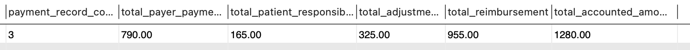

_Figure 26: Payment component summary including payer payment, patient responsibility, contractual adjustments, and total reimbursement._

### 25. Denial rate by payer: 

* **Objective:** Compare denial volume and denied dollars across the three payers   
* **SQL Code:** 
```sql
SELECT
    ip.payer_name,
    COUNT(c.claim_id) AS claim_count,
    SUM(c.billed_amount) AS total_billed,
    SUM(c.allowed_amount) AS total_allowed,

    SUM(
        CASE
            WHEN c.claim_status = 'Denied' THEN 1
            ELSE 0
        END
    ) AS denied_claims,

    SUM(
        CASE
            WHEN c.claim_status = 'Denied'
                THEN c.billed_amount
            ELSE 0
        END
    ) AS denied_billed_amount,

    ROUND(
        100.0 * SUM(
            CASE
                WHEN c.claim_status = 'Denied' THEN 1
                ELSE 0
            END
        ) / COUNT(c.claim_id),
        1
    ) AS denial_rate_percentage

FROM claims AS c
INNER JOIN insurance_plans AS ip
    ON c.insurance_plan_id = ip.insurance_plan_id
GROUP BY
    ip.insurance_plan_id,
    ip.payer_name
ORDER BY denial_rate_percentage DESC;
```
* **Output Result:** Because the dataset is synthetic and extremely small, these rates demonstrate SQL analysis rather than reliable payer-performance estimates.
<!--Place cursor below and paste your screenshot here -->
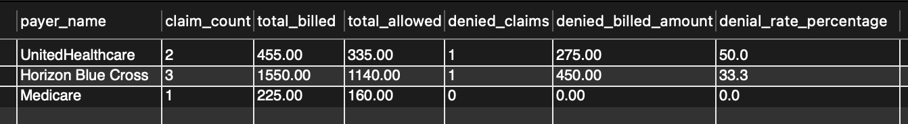

_Figure 27: Denied dollars and denial volumes by payer, enabling payer-level denial performance comparison._

### 26. Denial rate by provider. Compare denial frequency across providers and specialties. 

* **Objective:** Compare denial frequency across providers and specialties
* **SQL Code:** 
```sql
SELECT
    pr.provider_name,
    pr.specialty,
    COUNT(c.claim_id) AS claim_count,
    SUM(c.billed_amount) AS total_billed,
    SUM(c.allowed_amount) AS total_allowed,

    SUM(
        CASE
            WHEN c.claim_status = 'Denied' THEN 1 
            ELSE 0
        END
    ) AS denied_claims,

    ROUND(
        100.0 * SUM(
            CASE
                WHEN c.claim_status = 'Denied' THEN 1 
                ELSE 0
            END
        ) / COUNT(c.claim_id),
        1
    ) AS denial_rate_percentage
FROM claims AS c
INNER JOIN providers AS pr
    ON c.provider_id = pr.provider_id
GROUP BY
    pr.provider_id,
    pr.provider_name,
    pr.specialty
ORDER BY denial_rate_percentage DESC;
```
* **Output Result:** Again, these are demonstration results, not a valid real-world provider comparison.
<!--Place cursor below and paste your screenshot here -->
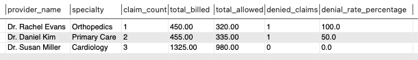

_Figure 28: Denial performance summary by provider and specialty, indicating provider-level trends for denied claims._

### 27. Create a revenue-cycle follow-up queue 

* **Objective:** Produce an operational worklist containing denied and pending claims.
* **SQL Code:** 
```sql
SELECT
    c.claim_id,
    CONCAT(pt.first_name, ' ', pt.last_name) AS patient_name,
    ip.payer_name,
    pr.provider_name,
    c.procedure_code,
    c.diagnosis_code,
    c.claim_status,
    c.billed_amount,
    c.allowed_amount,
    c.denial_reason,

    CASE
        WHEN c.claim_status = 'Denied'
            THEN 'Denial follow-up'
        WHEN c.claim_status = 'Pending'
            THEN 'Pending claim follow-up'
        ELSE 'No immediate follow-up'
    END AS follow_up_category

FROM claims AS c
INNER JOIN patients AS pt
    ON c.patient_id = pt.patient_id
INNER JOIN insurance_plans AS ip
    ON c.insurance_plan_id = ip.insurance_plan_id
INNER JOIN providers AS pr
    ON c.provider_id = pr.provider_id
WHERE c.claim_status IN ('Denied', 'Pending')
ORDER BY
    CASE
        WHEN c.claim_status = 'Denied' THEN 1
        WHEN c.claim_status = 'Pending' THEN 2
        ELSE 3
    END,
    c.billed_amount DESC;
```
* **Output Result:** Note that the ORDER BY CASE WHEN claim_status = 'Denied' THEN 1 
WHEN c.claim_status = 'Pending' THEN 2
ELSE 3, is not necessary. Without it, you get the same results
necessary
<!--Place cursor below and paste your screenshot here -->
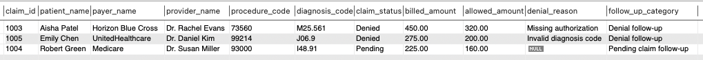

_Figure 29: Pending and denied follow-up worklist highlighting claims that require revenue-cycle intervention._

### 28: Executive KPI summary 

* **Objective:** Return the principal project metrics in one dashboard-ready row 
* **SQL Code:** 
```sql
SELECT
    COUNT(*) AS total_claims,
    SUM(billed_amount) AS total_billed,
    SUM(allowed_amount) AS total_allowed,

    SUM(
        CASE WHEN claim_status = 'Paid' THEN 1 ELSE 0 END
    ) AS paid_claims,

    SUM(
        CASE WHEN claim_status = 'Denied' THEN 1 ELSE 0 END
    ) AS denied_claims,

    SUM(
        CASE WHEN claim_status = 'Pending' THEN 1 ELSE 0 END
    ) AS pending_claims,

    ROUND(
        100.0 * SUM(
            CASE WHEN claim_status = 'Denied' THEN 1 ELSE 0 END
        ) / COUNT(*),
        1
    ) AS denial_rate_percentage,

    ROUND(
        100.0 * SUM(allowed_amount) / SUM(billed_amount),
        1
    ) AS overall_allowed_rate_percentage

FROM claims;
```
* **Output Result:** 
<!--Place cursor below and paste your screenshot here -->
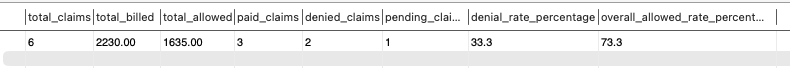

_Figure 30: Executive KPI summary dashboard row showing total claims, billed and allowed amounts, claim status counts, denial rate, and overall allowed rate._

### 29. Create a Reusable Claim Revenue Summary View. Then display the view.

* **Objective:** Create a reusable claim-level reporting dataset that combines patient, provider, insurance-plan, claim, and aggregated payment information. The view supports recurring analysis and dashboard development without requiring the underlying joins to be rewritten.

* **SQL Code:** 
```sql
CREATE OR REPLACE VIEW claim_revenue_summary AS

SELECT
    c.claim_id,

    c.patient_id,
    CONCAT(pt.first_name, ' ', pt.last_name) AS patient_name,
    pt.date_of_birth,
    pt.gender,
    pt.state AS patient_state,

    c.provider_id,
    pr.provider_name,
    pr.specialty,
    pr.npi_number,
    pr.facility_name,
    pr.state AS provider_state,

    c.insurance_plan_id,
    ip.payer_name,
    ip.plan_name,
    ip.plan_type,

    c.service_date,
    c.claim_submission_date,

    DATEDIFF(
        c.claim_submission_date,
        c.service_date
    ) AS submission_lag_days,

    c.procedure_code,
    c.diagnosis_code,
    c.claim_status,
    c.denial_reason,

    c.billed_amount,
    c.allowed_amount,

    c.billed_amount - c.allowed_amount
        AS contractual_difference,

    ROUND(
        100.0 * c.allowed_amount / c.billed_amount,
        1
    ) AS allowed_percentage,

    pay.payment_date,

    COALESCE(pay.payer_payment, 0)
        AS payer_payment,

    COALESCE(pay.patient_responsibility, 0)
        AS patient_responsibility,

    COALESCE(pay.adjustment_amount, 0)
        AS adjustment_amount,

    COALESCE(pay.payer_payment, 0)
        + COALESCE(pay.patient_responsibility, 0)
        AS total_reimbursement,

    c.allowed_amount
        - (
            COALESCE(pay.payer_payment, 0)
            + COALESCE(pay.patient_responsibility, 0)
          ) AS allowed_balance

FROM claims AS c

INNER JOIN patients AS pt
    ON c.patient_id = pt.patient_id

INNER JOIN providers AS pr
    ON c.provider_id = pr.provider_id

INNER JOIN insurance_plans AS ip
    ON c.insurance_plan_id = ip.insurance_plan_id

LEFT JOIN (
    SELECT
        claim_id,
        MAX(payment_date) AS payment_date,
        SUM(payer_payment) AS payer_payment,
        SUM(patient_responsibility)
            AS patient_responsibility,
        SUM(adjustment_amount)
            AS adjustment_amount
    FROM payments
    GROUP BY claim_id
) AS pay
    ON c.claim_id = pay.claim_id;

SELECT *
FROM claim_revenue_summary
ORDER BY claim_id;
```
* **Output Result:** The first part of the query creates the View, and the second part displays it. The view returns six rows, one for each claim, containing clinical, demographic, payer, provider, financial, payment, and claim-status information. The Reusable Claim Revenue Summary View was way to long to fit, hence I separated it into three parts that would fit the screen.
<!--Place cursor below and paste your screenshot here -->
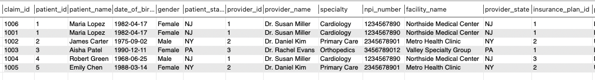
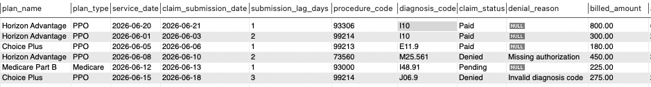
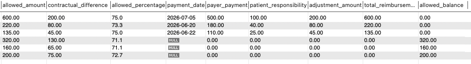

* **Business Value:** The view provides a consistent reporting layer for revenue-cycle analysis. It reduces duplicated SQL logic, standardizes metric calculations, and can serve as a source for subsequent queries, exports, or dashboards.

### Executive Summary
This project demonstrates how a relational MySQL database can support healthcare revenue-cycle reporting, claims analysis, denial management, payment reconciliation, and operational follow-up.

The synthetic dataset contains six claims submitted across three insurance plans and three providers. Total billed charges were $2,230.00, of which $1,635.00 was allowed, producing an overall allowed-to-billed rate of 73.3%. Three claims were paid, two were denied, and one remained pending.

The analysis identified a 33.3% claim-count denial rate and a 32.5% denied-dollar rate. All three paid claims reconciled successfully: payer payments plus patient responsibility equaled allowed amounts, and contractual adjustments matched the differences between billed and allowed amounts.

The project also created an operational worklist containing two denied claims and one pending claim requiring follow-up.

### Notable Findings
- Six claims generated $2,230.00 in billed charges and $1,635.00 in allowed amounts.
- The overall allowed-to-billed rate was 73.3%.
- Three claims were Paid, two were Denied, and one was Pending.
- The claim-count denial rate was 33.3%.
- Denied claims represented $725.00, or 32.5%, of total billed charges.
- Missing authorization accounted for $450.00 in denied charges.
- An invalid diagnosis code accounted for $275.00 in denied charges.
- Paid claims generated $955.00 in total reimbursement:
  - $790.00 in payer payments
  - $165.00 in patient responsibility
- Paid claims also contained $325.00 in contractual adjustments.
- All three paid claims were fully reconciled, with no allowed-balance or adjustment variance.
- No paid claims were missing payment records.
- No payments were associated with denied or pending claims.
- Every denied claim contained a documented denial reason.
- Average claim-submission lag was 1.67 days.
- Maximum submission lag was three days.
- One claim exceeded the project’s two-day submission benchmark.
- Paid claims were paid within 14–17 days after submission, with an average payment turnaround of approximately 15.7 days.
- The operational follow-up queue contained three claims:
  - Two denied claims
  - One pending claim
  - $950.00 in combined billed charges
  - $680.00 in combined allowed amounts

### Business Impact
The SQL analyses developed in this project could help a healthcare organization:
- Quantify claim volume and financial performance by status.
- Monitor claim-count and denied-dollar rates.
- Prioritize high-value denied claims for investigation and resubmission. 
- Identify recurring denial reasons, such as missing authorization or diagnosis-code problems.
- Compare claim activity across payers, providers, specialties, procedures, and diagnoses.
- Reconcile billed charges, allowed amounts, payer payments, patient responsibility, and contractual adjustments.
- Detect paid claims without payment records.
- Identify payments posted against claims with incompatible statuses.
- Monitor claim-submission turnaround and flag delayed submissions.
- Build a denial-management and pending-claim follow-up worklist.
- Support dashboard development through reusable KPI queries.
- Improve the accuracy and auditability of revenue-cycle reporting.
- Reduce the risk of preventable revenue leakage caused by incomplete follow-up, incorrect coding, authorization failures, or payment-posting discrepancies.

### Operational Interpretation
The two denials indicate different potential intervention points:
- Missing authorization suggests a need for stronger pre-service authorization verification or documentation controls.
- Invalid diagnosis code suggests a need for coding validation before claim submission.

The pending claim should be monitored separately because it has not reached a final adjudication status. It should not be classified as denied revenue or included in paid-claim reimbursement totals.

The payment-reconciliation queries demonstrated that all paid claims were financially balanced, indicating that payment records, patient-responsibility amounts, and contractual adjustments were internally consistent with the corresponding claim records.

### Data-Quality Validation Results
The project’s exception queries confirmed that:
- Every paid claim had an associated payment record.
- No payment was attached to a denied or pending claim.
- Every denied claim had a documented denial reason.
- All paid claims reconciled to their allowed amounts.
- All recorded contractual adjustments matched billed-minus-allowed differences.
- No payment-reconciliation exceptions were found.
A query returning zero rows is a valid result when it is designed to identify exceptions.
In this project, zero-row results demonstrate that the tested business rule passed.

### Limitations
- The dataset is synthetic and contains only six claims.
- All claims fall within a short June 2026 service period.
- Payer-, provider-, procedure-, and diagnosis-level rates are based on very small denominators.
- A 0%, 50%, or 100% segment denial rate should therefore be treated as a demonstration of SQL functionality, not a reliable performance estimate.
- The database does not contain claim-line detail, remittance-advice codes, appeal activity, corrected claims, write-offs, multiple payments per claim, or accounts-receivable aging.
- The two-day submission threshold is a project-defined operational benchmark, not a statutory or payer-specific timely-filing limit.
- The analysis identifies associations and operational exceptions; it does not prove why a claim was denied or establish causal provider or payer performance differences.

### Future Enhancements
Potential next steps include:
- Expand the dataset across multiple months and several hundred claims.
- Add claim-line records to support line-level denial analysis.
- Add CARC and RARC remittance codes.
- Add appeal status, appeal date, and appeal outcome.
- Add corrected-claim and resubmission tracking.
- Add accounts-receivable aging buckets.
- Calculate clean-claim rate and first-pass acceptance rate.
- Calculate days in accounts receivable.
- Track denial overturn and recovery rates.
- Use the `claim_revenue_summary` view as the source for an interactive revenue-cycle dashboard.
- Add payer-specific timely-filing limits.
- Support multiple payment and adjustment records per claim.
- Build a Tableau or Power BI revenue-cycle dashboard.
- Automate recurring exception and reconciliation reports.

### Conclusion

This project demonstrates the construction of a normalized healthcare revenue-cycle database and the translation of claims and payment data into operationally useful SQL analyses. The completed queries support financial summarization, denial analysis, payment reconciliation, submission monitoring, data validation, and follow-up prioritization.
The reusable `claim_revenue_summary` view creates a standardized reporting layer that can support recurring analysis, data exports, and future dashboard development. Although the dataset is synthetic and intentionally small, the project demonstrates a scalable approach to relational data modeling, healthcare revenue-cycle analysis, exception detection, and operational reporting.


