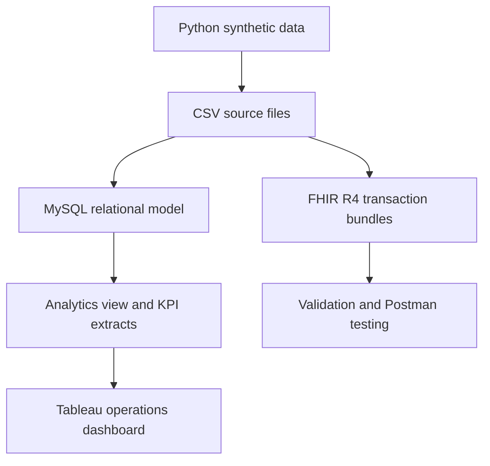

# Healthcare Prior Authorization Workflow and FHIR API Integration

An end-to-end healthcare interoperability and operational analytics project that models the prior-authorization lifecycle for a fictional health system. The project combines workflow analysis, synthetic data generation, relational database design, FHIR R4–aligned resources, REST API testing, and an interactive Tableau dashboard.

> **Data notice:** All patients, providers, payers, identifiers, clinical records, and outcomes in this repository are synthetic. No protected health information (PHI) is included.

## Live Dashboard

[View the Healthcare Prior Authorization Operations Dashboard on Tableau Public](https://public.tableau.com/app/profile/brandon.mcdermott/viz/HealthcarePriorAuthorizationOperationsDashboard/PriorAuthorizationOperationsDashboard)

[](https://public.tableau.com/app/profile/brandon.mcdermott/viz/HealthcarePriorAuthorizationOperationsDashboard/PriorAuthorizationOperationsDashboard)

## Project Objective

Prior-authorization work is often distributed across manual handoffs, incomplete submissions, payer follow-up, and disconnected status tracking. This project demonstrates how a health network could create a more measurable workflow by:

- validating submission completeness;
- tracking each request from creation through payer decision;
- identifying pending and overdue authorizations;
- measuring approval, denial, rework, turnaround, and SLA performance;
- representing selected authorization records with connected FHIR R4 resources; and
- giving operational staff an actionable dashboard and overdue work queue.

## Solution Overview



## Dataset and Results

The reproducible dataset uses random seed `42` and contains:

| Measure | Result |
|---|---:|
| Synthetic patients | 50 |
| Authorization requests | 200 |
| Status-history events | 728 |
| Submitted requests | 184 |
| Finalized requests | 110 |
| Approval rate | 72.7% |
| Denial rate | 27.3% |
| First-pass completeness | 71.7% |
| Rework rate | 28.3% |
| Average decision turnaround | 48.8 hours |
| Decision SLA compliance | 79.1% |
| Pending requests | 70 |
| Overdue requests | 69 |

Pending-age metrics use a fixed analytical reference time of **July 1, 2026** so the results remain reproducible. These figures describe a synthetic case study and are not real-world clinical or payer benchmarks.

## FHIR R4 Alignment

The project creates approved and denied transaction bundles with linked resources:

| Project concept | FHIR R4 resource |
|---|---|
| Patient demographics | `Patient` |
| Ordering provider | `Practitioner` |
| Payer | `Organization` |
| Insurance coverage | `Coverage` |
| Requested service | `ServiceRequest` |
| Authorization submission | `Claim` |
| Payer decision | `ClaimResponse` |
| Workflow status and required action | `Task` |

The bundles are educational, FHIR-aligned prototypes. They are not presented as production implementations or as fully conformant implementations of the HL7 Da Vinci Prior Authorization Support Implementation Guide.

## Technology

- Python 3 for deterministic data generation and validation
- MySQL 8 and MySQL Workbench for relational storage and analytics
- HL7 FHIR R4 and JSON for interoperability modeling
- Postman and a public FHIR test endpoint for REST API demonstrations
- Tableau Public for interactive operational reporting
- Markdown, Git, and GitHub for documentation and version control

## Repository Structure

```text
Project_3_Healthcare_Prior_Authorization_FHIR/
├── dashboard/   # Tableau packaged workbook and published-dashboard URL
├── data/
│   ├── fhir/    # Approved and denied FHIR transaction bundles
│   ├── processed/ # Dashboard-ready analytical extracts
│   └── source/  # Synthetic relational source data
├── docs/        # Charter, requirements, workflow, dictionary, and FHIR mapping
├── images/      # Dashboard, validation, SQL, and Postman evidence
├── postman/     # Exported API test collection
├── python/      # Data and FHIR generation/validation scripts
└── sql/         # Database, validation, analytical view, and KPI queries
```

## Reproduce the Python Outputs

The Python scripts use only the standard library, so no third-party packages are required.

From the project root, run:

```bash
python3 python/generate_synthetic_data.py
python3 python/validate_synthetic_data.py
python3 python/generate_fhir_bundles.py
python3 python/validate_fhir_bundles.py
```

Successful validation confirms referential integrity, authorization lifecycle rules, required payer-decision fields, FHIR bundle structure, and internal resource references.

## Reproduce the Database Analysis

1. Run [`sql/create_database.sql`](sql/create_database.sql) in MySQL 8.
2. Import the eight CSV files from [`data/source`](data/source) into their corresponding tables.
3. Run [`sql/post_import_validation.sql`](sql/post_import_validation.sql) to verify record counts, keys, relationships, and business rules.
4. Run [`sql/authorization_analytics.sql`](sql/authorization_analytics.sql) to create `vw_authorization_operations` and calculate the operational KPIs.
5. Use [`data/processed/authorization_operations.csv`](data/processed/authorization_operations.csv) as the Tableau dashboard source.

If using `LOAD DATA LOCAL INFILE`, update any local file paths for your machine and ensure local-file loading is enabled in both MySQL Server and the client.

## Dashboard Features

The Tableau dashboard includes:

- executive KPI cards;
- authorization status distribution;
- average decision turnaround by payer;
- procedure-level performance;
- denial-reason analysis;
- pending and overdue request indicators;
- an operational work queue prioritizing expedited requests and greatest pending age; and
- interactive filters for payer, urgency, status, procedure, and provider analysis.

The packaged workbook is available at [`dashboard/Project_3_Prior_Authorization_Dashboard.twbx`](dashboard/Project_3_Prior_Authorization_Dashboard.twbx).

## Documentation

- [Project charter](docs/project_charter.md)
- [Business and technical requirements](docs/requirements.md)
- [Current-state and future-state workflow analysis](docs/workflow_analysis.md)
- [Data dictionary](docs/data_dictionary.md)
- [FHIR resource mapping](docs/fhir_mapping.md)

## API Demonstration

The [`postman`](postman) directory contains an exported collection for submitting the approved and denied transaction bundles and retrieving selected `Patient`, `Claim`, `ClaimResponse`, and `Task` resources. Screenshots in [`images`](images) document the requests and responses.

## Key Skills Demonstrated

- Healthcare workflow and requirements analysis
- Prior-authorization operations and KPI design
- Relational data modeling and SQL analytics
- Synthetic healthcare data engineering and validation
- FHIR R4 resource mapping and reference integrity
- REST API testing with Postman
- Tableau dashboard development and operational storytelling

## Author

**Brandon McDermott**  
Healthcare data, interoperability, and analytics portfolio
