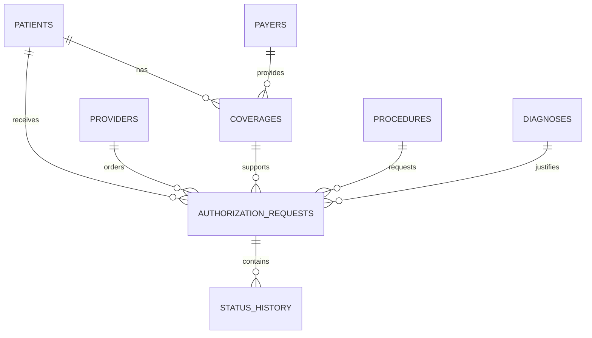

# Synthetic Data Dictionary

**Project:** Healthcare Prior Authorization Workflow and FHIR API Integration  
**Organization:** Northstar Health Network — Synthetic Case Study  
**Author:** Brandon McDermott  
**Status:** In Development  

## 1. Purpose

This document defines the synthetic data model used to represent patients, providers, payers, insurance coverage, procedures, diagnoses, prior-authorization requests, and authorization-status events.

All records are fictional and contain no protected health information.

## 2. Dataset Structure

The project will use eight related datasets:

| Dataset | Purpose |
|---|---|
| patients | Synthetic patient information |
| providers | Ordering-provider information |
| payers | Insurance payer and service-level information |
| coverages | Patient insurance enrollment |
| procedures | Clinical services requiring authorization |
| diagnoses | Diagnoses supporting medical necessity |
| authorization_requests | Primary authorization transaction records |
| status_history | Chronological authorization-status events |

## 3. Entity Relationships

## 4. Patients

**Filename:** `patients.csv`  
**Primary key:** `patient_id`

| Field | Type | Required | Description | Example |
|---|---|---:|---|---|
| patient_id | VARCHAR(10) | Yes | Project patient identifier | PAT001 |
| medical_record_number | VARCHAR(12) | Yes | Synthetic health-system record number | MRN100001 |
| first_name | VARCHAR(50) | Yes | Synthetic given name | Elena |
| last_name | VARCHAR(50) | Yes | Synthetic family name | Torres |
| birth_date | DATE | Yes | Patient date of birth | 1978-04-16 |
| administrative_sex | VARCHAR(10) | Yes | Administrative sex value | female |
| postal_code | VARCHAR(10) | Yes | Synthetic postal code | 07054 |

Allowed `administrative_sex` values:

- female
- male
- other
- unknown

## 5. Providers

**Filename:** `providers.csv`  
**Primary key:** `provider_id`

| Field | Type | Required | Description | Example |
|---|---|---:|---|---|
| provider_id | VARCHAR(10) | Yes | Project provider identifier | PRV001 |
| npi | VARCHAR(10) | Yes | Synthetic 10-digit provider identifier | 1000000001 |
| provider_name | VARCHAR(100) | Yes | Synthetic provider name | Maya Chen, MD |
| specialty | VARCHAR(75) | Yes | Provider specialty | Orthopedic Surgery |
| organization_name | VARCHAR(100) | Yes | Provider organization | Northstar Medical Group |
| active | BOOLEAN | Yes | Whether the provider is active | TRUE |

All NPI values are synthetic and must not be presented as real provider identifiers.

## 6. Payers

**Filename:** `payers.csv`  
**Primary key:** `payer_id`

| Field | Type | Required | Description | Example |
|---|---|---:|---|---|
| payer_id | VARCHAR(10) | Yes | Project payer identifier | PAY001 |
| payer_name | VARCHAR(100) | Yes | Fictional payer name | Summit Health Plan |
| plan_type | VARCHAR(20) | Yes | Insurance-plan classification | PPO |
| standard_sla_hours | INTEGER | Yes | Synthetic decision target in hours | 72 |
| expedited_sla_hours | INTEGER | Yes | Synthetic expedited target in hours | 24 |
| active | BOOLEAN | Yes | Whether the payer is active | TRUE |

Allowed `plan_type` values:

- HMO
- PPO
- EPO
- POS
- Medicaid
- Medicare Advantage

The SLA values are project assumptions for analytical demonstration. They are not represented as statutory or contractual requirements.

## 7. Coverage

**Filename:** `coverages.csv`  
**Primary key:** `coverage_id`  
**Foreign keys:** `patient_id`, `payer_id`

| Field | Type | Required | Description | Example |
|---|---|---:|---|---|
| coverage_id | VARCHAR(10) | Yes | Coverage identifier | COV001 |
| patient_id | VARCHAR(10) | Yes | Related patient | PAT001 |
| payer_id | VARCHAR(10) | Yes | Related payer | PAY001 |
| member_id | VARCHAR(20) | Yes | Synthetic insurance member number | MBR100001 |
| group_number | VARCHAR(20) | No | Synthetic employer or plan group | GRP2001 |
| coverage_start_date | DATE | Yes | Coverage effective date | 2026-01-01 |
| coverage_end_date | DATE | No | Coverage termination date | 2026-12-31 |
| coverage_status | VARCHAR(15) | Yes | Current coverage status | active |

Allowed `coverage_status` values:

- active
- inactive
- cancelled
- pending

## 8. Procedures

**Filename:** `procedures.csv`  
**Primary key:** `procedure_id`

| Field | Type | Required | Description | Example |
|---|---|---:|---|---|
| procedure_id | VARCHAR(10) | Yes | Project procedure identifier | PROC001 |
| procedure_code | VARCHAR(10) | Yes | Procedure code used in the case | 72148 |
| procedure_description | VARCHAR(150) | Yes | Requested clinical service | MRI lumbar spine without contrast |
| service_category | VARCHAR(50) | Yes | General service category | Diagnostic Imaging |
| authorization_required | BOOLEAN | Yes | Whether authorization is required | TRUE |

## 9. Diagnoses

**Filename:** `diagnoses.csv`  
**Primary key:** `diagnosis_id`

| Field | Type | Required | Description | Example |
|---|---|---:|---|---|
| diagnosis_id | VARCHAR(10) | Yes | Project diagnosis identifier | DX001 |
| diagnosis_code | VARCHAR(10) | Yes | Diagnosis code used in the case | M54.50 |
| diagnosis_description | VARCHAR(150) | Yes | Diagnosis description | Low back pain, unspecified |
| code_system | VARCHAR(20) | Yes | Coding system | ICD-10-CM |

## 10. Authorization Requests

**Filename:** `authorization_requests.csv`  
**Primary key:** `authorization_id`

Foreign keys:

- `patient_id`
- `provider_id`
- `coverage_id`
- `procedure_id`
- `diagnosis_id`

| Field | Type | Required | Description | Example |
|---|---|---:|---|---|
| authorization_id | VARCHAR(12) | Yes | Authorization-request identifier | AUTH0001 |
| patient_id | VARCHAR(10) | Yes | Patient receiving the service | PAT001 |
| provider_id | VARCHAR(10) | Yes | Ordering provider | PRV001 |
| coverage_id | VARCHAR(10) | Yes | Insurance coverage used | COV001 |
| procedure_id | VARCHAR(10) | Yes | Requested service | PROC001 |
| diagnosis_id | VARCHAR(10) | Yes | Supporting diagnosis | DX001 |
| created_at | DATETIME | Yes | Request creation timestamp | 2026-01-06 09:15:00 |
| submitted_at | DATETIME | Conditional | Payer-submission timestamp | 2026-01-06 14:30:00 |
| urgency | VARCHAR(15) | Yes | Request priority | standard |
| initial_submission_complete | BOOLEAN | Yes | Whether the initial payer submission was complete | TRUE |
| documentation_status | VARCHAR(20) | Yes | Supporting-documentation state | complete |
| current_status | VARCHAR(40) | Yes | Most recent authorization status | Approved |
| decision_at | DATETIME | Conditional | Final payer-decision timestamp | 2026-01-08 11:00:00 |
| authorization_number | VARCHAR(30) | No | Payer-issued approval identifier | PA-260001 |
| denial_reason | VARCHAR(150) | No | Structured denial explanation | Missing clinical documentation |
| requested_service_date | DATE | Yes | Intended service date | 2026-01-15 |

Allowed `urgency` values:

- standard
- expedited

Allowed `documentation_status` values:

- complete
- incomplete
- not-required
- pending-review

Allowed `current_status` values:

- Draft
- Submitted
- Additional Information Required
- In Review
- Approved
- Denied
- Cancelled

## 11. Status History

**Filename:** `status_history.csv`  
**Primary key:** `status_event_id`  
**Foreign key:** `authorization_id`

| Field | Type | Required | Description | Example |
|---|---|---:|---|---|
| status_event_id | VARCHAR(14) | Yes | Status-event identifier | EVT000001 |
| authorization_id | VARCHAR(12) | Yes | Related authorization request | AUTH0001 |
| status | VARCHAR(40) | Yes | Status recorded during the event | Submitted |
| status_at | DATETIME | Yes | Time of the status event | 2026-01-06 14:30:00 |
| actor_type | VARCHAR(30) | Yes | Party responsible for the event | Authorization Specialist |
| action_required | BOOLEAN | Yes | Whether staff action is required | FALSE |
| event_notes | VARCHAR(255) | No | Synthetic operational note | Request submitted electronically |

Allowed `actor_type` values:

- Ordering Provider
- Clinical Staff
- Authorization Specialist
- Payer
- Scheduling Staff
- System

## 12. Relationship Rules

1. Every coverage record must reference an existing patient and payer.
2. Every authorization request must reference an existing patient, provider, coverage, procedure, and diagnosis.
3. The patient referenced by an authorization request must match the patient associated with its coverage.
4. Every status-history event must reference an existing authorization request.
5. Status events for each request must occur in chronological order.
6. The most recent status-history value must match the request’s `current_status`.
7. A submitted request must contain a `submitted_at` timestamp.
8. Approved and denied requests must contain a `decision_at` timestamp.
9. Approved requests should contain an `authorization_number`.
10. Denied requests must contain a `denial_reason`.
11. Requests in Draft status must not contain a payer decision.
12. A coverage record must be active on the request submission date.

## 13. Derived Analytical Fields

These values will be calculated rather than stored in the source CSV files:

| Derived field | Calculation |
|---|---|
| turnaround_hours | Hours between `submitted_at` and `decision_at` |
| pending_age_hours | Hours between `submitted_at` and the analytical reference time |
| applicable_sla_hours | Standard or expedited payer SLA based on urgency |
| overdue_flag | TRUE when pending age exceeds the applicable SLA |
| first_pass_complete_flag | Value of `initial_submission_complete` |
| final_decision_flag | TRUE when status is Approved or Denied |
| rework_flag | TRUE when status history includes Additional Information Required |

## 14. Planned Dataset Size

The first generated dataset will contain approximately:

| Dataset | Planned records |
|---|---:|
| patients | 50 |
| providers | 10 |
| payers | 5 |
| coverages | 55 |
| procedures | 10 |
| diagnoses | 10 |
| authorization_requests | 200 |
| status_history | 600–900 |

This size is sufficient to demonstrate relationships, validation, API transformation, SQL analysis, and KPI reporting without making the project unnecessarily large.