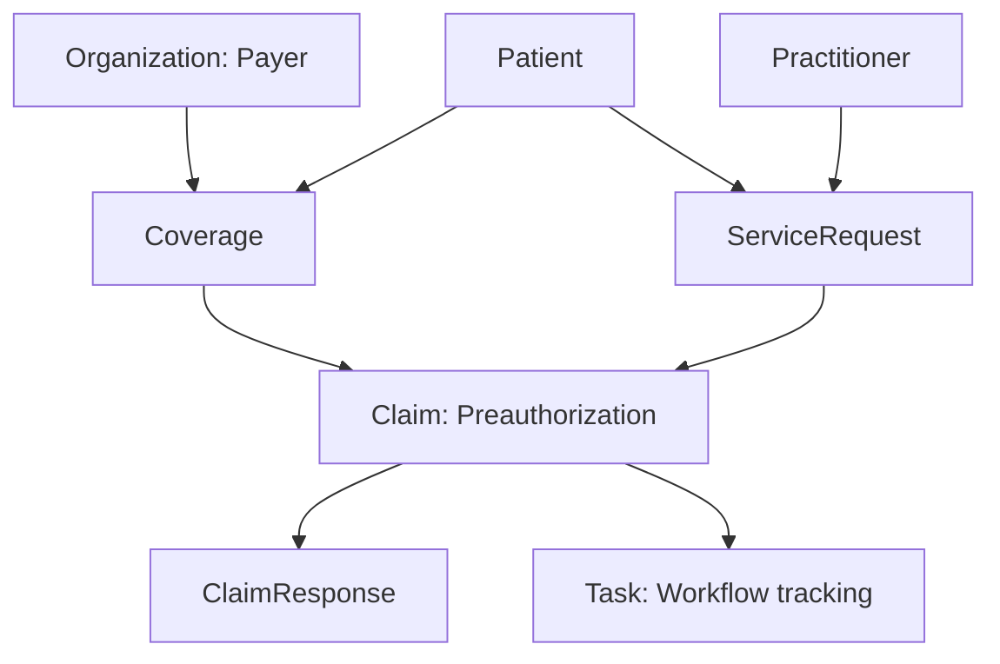

# HL7 FHIR R4 Resource Mapping

**Project:** Healthcare Prior Authorization Workflow and FHIR API Integration  
**Organization:** Northstar Health Network — Synthetic Case Study  
**Author:** Brandon McDermott  
**FHIR Version:** R4  
**Status:** In Development  

## 1. Purpose

This document maps the project’s relational prior-authorization data to selected HL7 FHIR R4 resources.

The mapping supports an educational interoperability prototype. It is not represented as a complete production implementation of the HL7 Da Vinci Prior Authorization Support Implementation Guide.

## 2. Resource Summary

| Relational source | FHIR R4 resource | Purpose |
|---|---|---|
| patients | Patient | Represents the person receiving the requested service |
| providers | Practitioner | Represents the ordering provider |
| payers | Organization | Represents the insurance payer |
| coverages | Coverage | Represents the patient’s insurance coverage |
| procedures and diagnoses | ServiceRequest | Represents the provider’s clinical order |
| authorization_requests | Claim | Represents the prior-authorization submission |
| payer decision fields | ClaimResponse | Represents the payer response |
| current status and required action | Task | Represents operational workflow tracking |

## 3. Patient Mapping

| Relational field | FHIR path |
|---|---|
| patient_id | Patient.id |
| medical_record_number | Patient.identifier.value |
| first_name | Patient.name.given |
| last_name | Patient.name.family |
| birth_date | Patient.birthDate |
| administrative_sex | Patient.gender |
| postal_code | Patient.address.postalCode |

## 4. Practitioner Mapping

| Relational field | FHIR path |
|---|---|
| provider_id | Practitioner.id |
| npi | Practitioner.identifier.value |
| provider_name | Practitioner.name.text |
| specialty | Practitioner.qualification.code.text |
| active | Practitioner.active |

The generated NPI values are synthetic and must not be presented as real provider identifiers.

## 5. Payer Organization Mapping

| Relational field | FHIR path |
|---|---|
| payer_id | Organization.id |
| payer_name | Organization.name |
| active | Organization.active |
| plan_type | Organization.type.text |

The operational SLA fields remain analytical attributes. They are not mapped directly to standard Organization fields.

## 6. Coverage Mapping

| Relational field | FHIR path |
|---|---|
| coverage_id | Coverage.id |
| member_id | Coverage.identifier.value |
| coverage_status | Coverage.status |
| patient_id | Coverage.beneficiary.reference |
| payer_id | Coverage.payor.reference |
| group_number | Coverage.class.value |
| coverage_start_date | Coverage.period.start |
| coverage_end_date | Coverage.period.end |

Example references:

```text
Patient/PAT001
Organization/PAY001
```

## 7. ServiceRequest Mapping

| Relational field | FHIR path |
|---|---|
| authorization_id | ServiceRequest.id |
| current workflow state | ServiceRequest.status |
| procedure_code | ServiceRequest.code.coding.code |
| procedure_description | ServiceRequest.code.coding.display |
| patient_id | ServiceRequest.subject.reference |
| provider_id | ServiceRequest.requester.reference |
| diagnosis_code | ServiceRequest.reasonCode.coding.code |
| created_at | ServiceRequest.authoredOn |
| urgency | ServiceRequest.priority |
| coverage_id | ServiceRequest.insurance.reference |

The prototype will use:

```text
ServiceRequest.intent = "order"
```

Example references:

```text
Patient/PAT001
Practitioner/PRV001
Coverage/COV001
```

## 8. Claim Mapping

The FHIR Claim resource represents the prior-authorization submission.

| Relational field | FHIR path |
|---|---|
| authorization_id | Claim.id |
| authorization_id | Claim.identifier.value |
| patient_id | Claim.patient.reference |
| provider_id | Claim.provider.reference |
| payer_id | Claim.insurer.reference |
| coverage_id | Claim.insurance.coverage.reference |
| created_at | Claim.created |
| procedure_code | Claim.item.productOrService.coding.code |
| diagnosis_code | Claim.diagnosis.diagnosisCodeableConcept.coding.code |
| urgency | Claim.priority.coding.code |

The prototype will use:

```text
Claim.use = "preauthorization"
```

The Claim resource represents submission and processing state. Approval or denial is represented through ClaimResponse rather than changing the Claim into an approval record.

## 9. ClaimResponse Mapping

| Relational field | FHIR path |
|---|---|
| authorization_id | ClaimResponse.id |
| authorization_id | ClaimResponse.request.reference |
| patient_id | ClaimResponse.patient.reference |
| payer_id | ClaimResponse.insurer.reference |
| decision_at | ClaimResponse.created |
| authorization_number | ClaimResponse.preAuthRef |
| denial_reason | ClaimResponse.item.adjudication.reason.text |

For finalized responses:

```text
ClaimResponse.outcome = "complete"
```

Approval or denial will be communicated through the adjudication content and human-readable disposition. The `outcome` field alone must not be interpreted as approval because FHIR uses it to represent processing completion.

ClaimResponse resources will be created only for authorization requests that have reached Approved or Denied status.

## 10. Task Mapping

The FHIR Task resource represents operational workflow state and staff action.

| Local status | Task.status |
|---|---|
| Draft | draft |
| Submitted | requested |
| Additional Information Required | on-hold |
| In Review | in-progress |
| Approved | completed |
| Denied | completed |
| Cancelled | cancelled |

The original operational status will also be retained in:

```text
Task.businessStatus.text
```

Additional mappings:

| Relational field | FHIR path |
|---|---|
| authorization_id | Task.id |
| current_status | Task.businessStatus.text |
| patient_id | Task.for.reference |
| authorization ID | Task.focus.reference |
| created_at | Task.authoredOn |
| latest status time | Task.lastModified |
| action-required state | Task.restriction or Task.note |

## 11. Reference Architecture



## 12. Mapping Limitations

This prototype does not include:

- Production payer connectivity
- SMART on FHIR authentication
- Complete terminology-server validation
- Every Da Vinci PAS profile or extension
- X12 278 translation
- Production EHR integration
- Real protected health information
- Automated medical-necessity determination

The project will generate structurally FHIR-aligned JSON and demonstrate resource relationships, API operations, workflow tracking, and prior-authorization concepts.