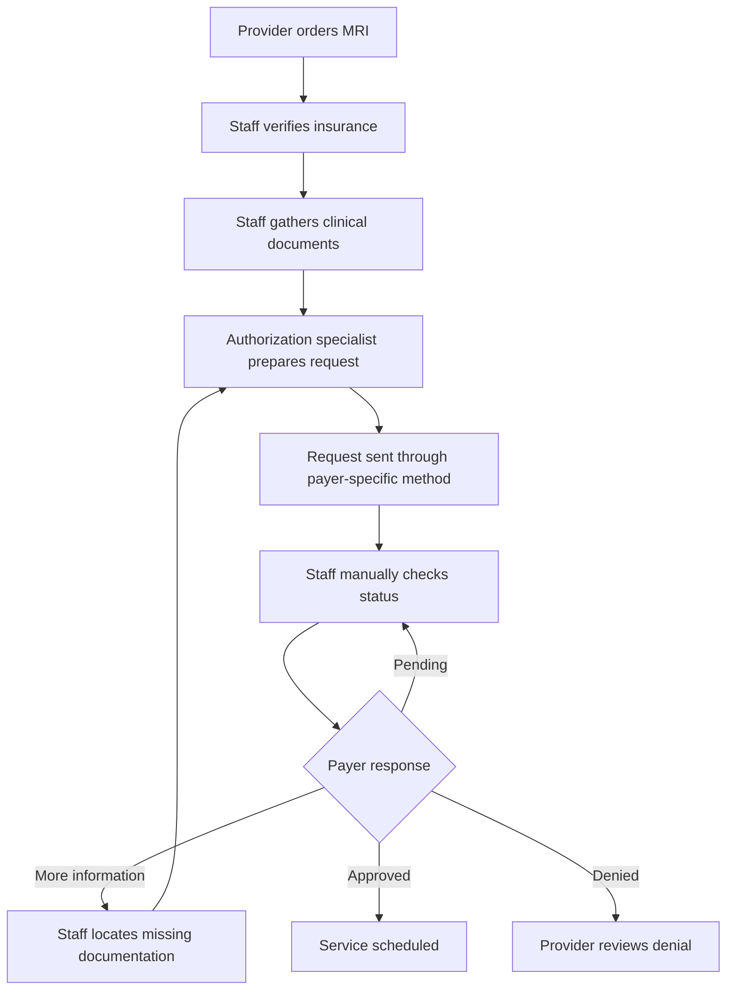
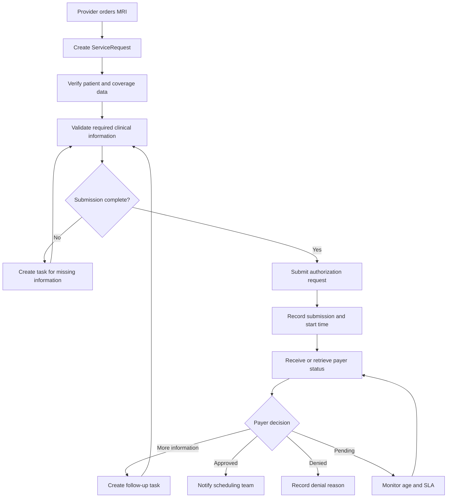
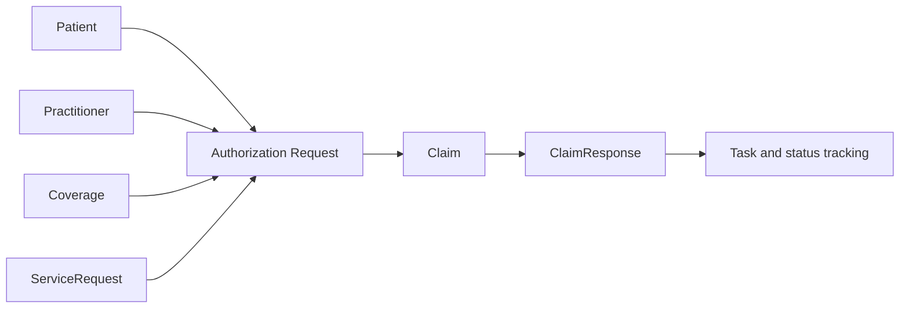

# Prior Authorization Workflow Analysis

**Project:** Healthcare Prior Authorization Workflow and FHIR API Integration  
**Organization:** Northstar Health Network — Synthetic Case Study  
**Author:** Brandon McDermott  
**Status:** In Development  

## 1. Workflow Objective

This analysis examines how Northstar Health Network submits, tracks, and resolves prior-authorization requests.

The initial use case involves an ordering provider requesting prior authorization for an MRI. The analysis compares a fragmented current-state process with a proposed future-state workflow using structured validation, standardized statuses, FHIR-aligned data, and operational monitoring.

## 2. Primary Stakeholders

| Stakeholder | Role in the workflow |
|---|---|
| Patient | Receives the requested service and may experience delays |
| Ordering provider | Determines that the service is clinically appropriate |
| Clinical staff | Collects clinical documentation supporting the request |
| Authorization specialist | Prepares, submits, and monitors the request |
| Payer | Reviews the request and returns a decision |
| Scheduling staff | Schedules the service after authorization |
| Revenue-cycle staff | Monitors administrative and financial effects |
| Healthcare IT team | Supports data exchange, workflow rules, and reporting |
| Operational leadership | Reviews performance and unresolved workflow problems |

## 3. Current-State Workflow

The current-state process relies on manual information gathering, inconsistent payer-submission methods, and repeated status checks.



## 4. Current-State Failure Points

| ID | Failure point | Operational effect |
|---|---|---|
| FP-01 | Insurance information may be incomplete or outdated | Request may be rejected or sent to the wrong payer |
| FP-02 | Required clinical documentation is not consistently identified before submission | Payer requests additional information |
| FP-03 | Payers use different portals, forms, and submission rules | Staff must manage inconsistent workflows |
| FP-04 | Request status is checked manually | Staff time is consumed by repeated follow-up |
| FP-05 | Status terminology is inconsistent | Teams may interpret request status differently |
| FP-06 | Status changes are not maintained in one structured record | Staff may act on outdated information |
| FP-07 | Pending requests are not automatically aged or prioritized | Overdue requests may remain unresolved |
| FP-08 | Denial reasons are not captured consistently | Root-cause analysis becomes difficult |
| FP-09 | Scheduling staff may not receive the decision promptly | Patient scheduling may be delayed |
| FP-10 | Leadership lacks standardized performance metrics | Workflow problems remain difficult to quantify |

## 5. Current-State Risks

The current workflow creates several risks:

- Delayed patient care
- Repeated administrative work
- Incomplete submissions
- Avoidable denials
- Missed payer-response deadlines
- Limited visibility into pending requests
- Inconsistent communication among departments
- Difficulty identifying payer-specific performance problems

## 6. Future-State Design Principles

The proposed future-state workflow will:

1. Validate required information before submission.
2. Use standardized authorization statuses.
3. Represent selected healthcare information with FHIR-aligned resources.
4. Maintain a structured record of status changes.
5. Identify requests requiring staff action.
6. Flag requests exceeding turnaround-time targets.
7. Capture payer decisions and denial reasons consistently.
8. Support operational KPI reporting.

## 7. Future-State Workflow



## 8. Future-State Status Model

Each authorization request will use one of the following standardized statuses:

| Status | Meaning |
|---|---|
| Draft | Request has been created but is not ready for submission |
| Submitted | Request has been sent to the payer |
| Additional Information Required | Payer or internal validation requires more information |
| In Review | Payer is reviewing the submitted request |
| Approved | Payer authorized the requested service |
| Denied | Payer did not authorize the requested service |
| Cancelled | Request was withdrawn or is no longer required |

Approved, denied, and cancelled are treated as terminal statuses. Other statuses remain active and may require monitoring or intervention.

## 9. Proposed FHIR-Aligned Information Flow



The authorization request is a project-level operational record rather than a separate FHIR resource. It connects the clinical request, coverage information, payer submission, payer response, and workflow status.

## 10. Expected Improvements

| Current-state problem | Proposed improvement |
|---|---|
| Incomplete requests discovered after submission | Validate required information before submission |
| Manual and inconsistent status tracking | Store standardized statuses and status timestamps |
| Repeated payer follow-up | Track pending age and identify overdue requests |
| Unstructured requests for additional information | Create defined follow-up tasks |
| Inconsistent denial documentation | Record structured denial reasons |
| Delayed communication with scheduling | Trigger action after approval |
| Limited operational visibility | Calculate standardized KPIs |
| Fragmented healthcare information | Map selected data to FHIR-aligned resources |

## 11. Initial Business Rules

### BRULE-01: Required Identifiers

A request cannot be submitted without a valid patient, provider, payer, coverage, procedure, and diagnosis identifier.

### BRULE-02: Supporting Documentation

A request requiring supporting documentation cannot be considered complete when the documentation status is missing or incomplete.

### BRULE-03: Terminal Status

Approved, denied, and cancelled requests must not remain classified as pending.

### BRULE-04: Decision Date

Approved and denied requests must contain a payer decision date.

### BRULE-05: Denial Reason

A denied request must contain a denial reason.

### BRULE-06: Pending Age

Pending age will be measured from the submission timestamp through the current date or analytical reference date.

### BRULE-07: Turnaround Time

Turnaround time will be measured from submission to the final payer decision.

### BRULE-08: Overdue Request

A pending request will be flagged as overdue when its age exceeds its assigned service-level target.

## 12. Scope Limitation

The future-state workflow represents an educational prototype. It demonstrates workflow analysis, structured healthcare data, API concepts, FHIR-aligned resources, validation, and operational reporting.

It does not represent a production EHR integration, payer connection, or complete implementation of the HL7 Da Vinci Prior Authorization Support Implementation Guide.
```