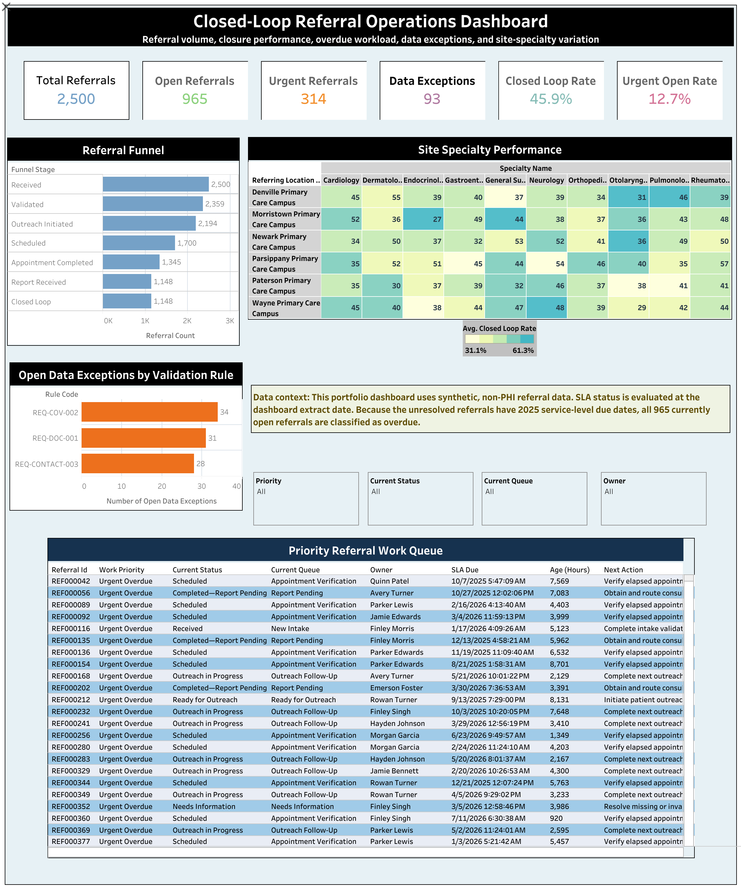

# Closed-Loop Referral Management Implementation

An end-to-end healthcare implementation and analytics project designed to improve referral visibility, operational accountability, appointment completion, consultation-report retrieval, and closed-loop performance.

This project simulates the implementation of a referral-management solution for a multisite healthcare organization using synthetic, non-PHI data.

## Live Dashboard

[View the Closed-Loop Referral Operations Dashboard on Tableau Public](https://public.tableau.com/app/profile/brandon.mcdermott/viz/ClosedLoopReferralOperationsDashboard/Closed-LoopReferralOperationsDashboard)



## Business Problem

Healthcare organizations frequently lose visibility after referrals leave the originating practice. Common operational challenges include:

- Incomplete referral information
- Delayed patient outreach
- Unscheduled specialty appointments
- Missed or cancelled appointments
- Unreturned consultation reports
- Unclear staff ownership
- Overdue referrals without an actionable work queue
- Limited site- and specialty-level performance reporting

These gaps can delay treatment, increase administrative work, create patient-safety risks, and prevent confirmation that the referral was completed.

## Project Objective

Design and validate a closed-loop referral-management solution that:

- Tracks referrals from receipt through closure
- Validates required referral information
- Assigns operational ownership
- Prioritizes urgent and overdue referrals
- Monitors outreach and scheduling activity
- Captures appointment outcomes
- Tracks consultation-report retrieval and review
- Identifies workflow and data-quality exceptions
- Provides operational and executive performance reporting

## Tools and Technologies

- MySQL and MySQL Workbench
- SQL
- Python
- Pandas
- Synthetic healthcare data
- Tableau Public
- Visual Studio Code
- Git and GitHub
- Markdown
- Excel-based implementation documentation

## Solution Components

### Relational Database

The normalized MySQL database contains 15 interconnected tables:

- `patients`
- `coverages`
- `referrals`
- `referral_assignments`
- `referral_status_history`
- `outreach_attempts`
- `appointments`
- `consult_reports`
- `referral_validation_issues`
- `practitioners`
- `organizations`
- `locations`
- `users`
- `specialties`
- `payers`

Primary keys, foreign keys, controlled values, timestamps, indexes, and data-validation rules support relational integrity and realistic healthcare workflows.

### Synthetic Data Generation

Python was used to generate a reproducible, non-PHI dataset representing:

- 2,000 patients
- 2,500 referrals
- 2,200 coverage records
- 1,783 appointments
- 1,148 consultation reports
- 4,294 outreach attempts
- 11,636 referral-status events
- 2,500 referral assignments
- 262 validation issues

The completed database contains 28,543 records across the 15 tables.

### Analytical Views

Five SQL views support operational reporting and Tableau visualization:

| View                           | Purpose                                      |  Rows |
| ------------------------------ | -------------------------------------------- | ----: |
| `v_referral_lifecycle`         | Complete referral lifecycle and KPI analysis | 2,500 |
| `v_operational_work_queue`     | Prioritized open-referral work queue         |   965 |
| `v_site_specialty_performance` | Location and specialty performance           |    60 |
| `v_data_exception_queue`       | Unresolved data-quality exceptions           |    93 |
| `v_referral_funnel`            | Referral-stage conversion funnel             |     7 |

### Operational Work Queue

The work queue converts referral data into actionable staff priorities using:

- Referral priority
- Current status
- Current queue
- Assigned owner
- Service-level due date
- Current-stage age
- Overdue status
- Recommended next action

Examples of recommended actions include:

- Initiate patient outreach
- Resolve missing or invalid information
- Complete the next outreach action
- Verify an elapsed appointment outcome
- Obtain and route a consultation report

## Dashboard KPIs

| KPI                         |    Result |
| --------------------------- | --------: |
| Total referrals             |     2,500 |
| Open referrals              |       965 |
| Urgent referrals            |       314 |
| Open data exceptions        |        93 |
| Intake completeness rate    |    94.36% |
| Scheduling conversion rate  |    77.48% |
| Appointment completion rate |    79.12% |
| Closed-loop rate            |    45.92% |
| Referral leakage rate       |    13.54% |
| Average days to schedule    |      3.76 |
| Average days to completion  |     23.15 |
| Average report turnaround   | 5.58 days |

The Tableau dashboard includes:

- Executive KPI cards
- Referral funnel analysis
- Site and specialty performance heat map
- Data-exception analysis
- Operational work queue
- Priority, status, queue, and owner filters

## Data Quality and Validation

The database was validated through 20 automated data-quality rules covering:

- Expected table volumes
- Required identifiers
- Referential integrity
- Controlled status values
- Chronological consistency
- Referral-assignment completeness
- Appointment-outcome consistency
- Consultation-report matching
- Duplicate detection
- Workflow-state consistency

Validation results:

| Measure                 | Result |
| ----------------------- | -----: |
| Rules tested            |     20 |
| Rules passed            |     20 |
| Rules failed            |      0 |
| Total detected failures |      0 |
| Expected database rows  | 28,543 |
| Actual database rows    | 28,543 |

## Implementation Documentation

The project includes implementation artifacts commonly used in healthcare technology and SaaS deployments:

- Business requirements
- Functional requirements
- Current-state workflow
- Future-state workflow
- Stakeholder analysis
- Requirements traceability matrix
- User acceptance testing workbook
- Data dictionary
- Data mapping and validation documentation
- Implementation and deployment planning materials

These artifacts connect business requirements to database functionality, analytical outputs, testing evidence, and operational use cases.

## User Acceptance Testing

User acceptance testing validates that the solution:

- Loads the expected data volumes
- Identifies open and overdue referrals
- Calculates operational KPIs correctly
- Prioritizes urgent referrals
- Assigns actionable next steps
- Reports site and specialty performance
- Identifies unresolved data exceptions
- Supports dashboard filtering
- Mantains traceability to functional requirements

## Repository Structure

```text
Project_4_Closed_Loop_Referral_Implementation/
├── Project_4_Synthetic_Data_Package.zip
├── README.md
├── dashboard/
│   ├── exports/
│   │   ├── Closed-Loop Referral Operations Dashboard.pdf
│   │   ├── data_exception_queue.csv
│   │   ├── operational_work_queue.csv
│   │   ├── referral_funnel.csv
│   │   ├── referral_lifecycle.csv
│   │   └── site_specialty_performance.csv
│   └── images/
│       ├── Data_Validation.png
│       ├── KPIs_1.png
│       ├── KPIs_2.png
│       ├── Overdue_Backlog_by_Work_Priority.png
│       ├── Referral_Leakage.png
│       ├── Tables_Constraints.png
│       ├── Tables_Constraints_1.png
│       ├── Tables_Constraints_2.png
│       ├── closed_loop_referral_dashboard.png
│       ├── referral_funnel.png
│       ├── referral_status_distribution.png
│       ├── uat_026_data_quality_results.png
│       ├── uat_028_work_queue_count.png
│       └── uat_029_executive_kpis.png
├── data/
│   ├── data_dictionary.md
│   ├── data_model.md
│   ├── processed/
│   │   ├── appointments.csv
│   │   ├── consult_reports.csv
│   │   ├── coverages.csv
│   │   ├── locations.csv
│   │   ├── organizations.csv
│   │   ├── outreach_attempts.csv
│   │   ├── patients.csv
│   │   ├── payers.csv
│   │   ├── practitioners.csv
│   │   ├── referral_assignments.csv
│   │   ├── referral_status_history.csv
│   │   ├── referral_validation_issues.csv
│   │   ├── referrals.csv
│   │   ├── specialties.csv
│   │   └── users.csv
│   └── raw/
│       ├── coverages_raw.csv
│       ├── intentional_defects_manifest.csv
│       ├── patients_raw.csv
│       └── referrals_raw.csv
├── database/
│   ├── analytics_queries.sql
│   ├── create_referral_database_v2.sql
│   ├── dashboard_views_csv.sql
│   ├── data_quality_checks.sql
│   ├── load_data.sql
│   └── operational_views.sql
├── implementation/
│   ├── Project_4_Requirements_Traceability_Matrix.xlsx
│   ├── Project_4_SaaS_Configuration_Workbook.xlsx
│   ├── Project_4_User_Acceptance_Testing_Workbook.xlsx
│   ├── current_state_workflow.md
│   ├── future_state_workflow.md
│   ├── metric_specification.md
│   ├── project_charter.md
│   ├── requirements.md
│   └── stakeholder_analysis.md
└── python/
    ├── generate_synthetic_data.py
    └── validate_synthetic_data.py
```

## Skills Demonstrated

- Healthcare workflow analysis
- Closed-loop referral management
- Healthcare implementation planning
- Requirements gathering and traceability
- Relational database design
- SQL development
- Synthetic healthcare-data generation
- Data-quality validation
- KPI design and calculation
- Operational work-queue development
- Tableau dashboard design
- User acceptance testing
- Technical documentation
- Stakeholder-focused data storytelling

## Business Value

The solution demonstrates how a healthcare organization can replace fragmented referral tracking with a centralized operational workflow that:

- Improves referral accountability
- Surfaces overdue work
- Reduces referral leakage
- Prioritizes urgent cases
- Identifies missing information
- Tracks appointment outcomes
- Supports consultation-report retrieval
- Measures performance across sites and specialties
- Gives operational teams a clear next action

## Data Privacy

All patients, clinicians, organizations, referrals, appointments, and operational events in this project are synthetic. No protected health information or real patient data is included.

## Author

Brandon McDermott  
Healthcare Data and Operations Analyst  
[Tableau Public](https://public.tableau.com/app/profile/brandon.mcdermott)  
[GitHub](https://github.com/BklynIrish)
