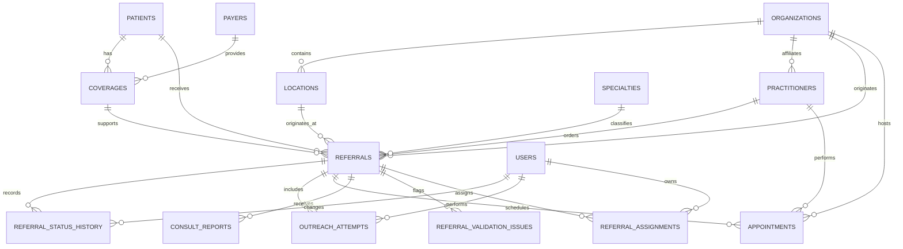

# Relational Data Model

## Project

**Closed-Loop Specialty Referral Management: Healthcare SaaS Implementation and Analytics**

## Purpose

This document defines the logical relational data model for the simulated NorthStar Medical Group referral-management implementation. It establishes the entities, relationships, keys, integrity controls, and design decisions that will guide the detailed data dictionary and MySQL schema.

All data will be synthetic. The model is designed for a portfolio-scale implementation and is not represented as a production EHR or certified clinical system.

## Design Goals

The model must support:

1. Traceability from the original referral through closure.
2. Separate representation of referral status, outreach, appointments, and consultation reports.
3. Multiple events per referral without overwriting history.
4. Standardized controlled values.
5. Required ownership, priority, aging, and escalation logic.
6. Source-to-target migration reconciliation.
7. FHIR resource mapping.
8. Reproducible KPI calculations and operational work queues.
9. Documented synthetic data-quality exceptions.
10. Clear separation between stored facts and derived analytical fields.

## Core Entities

| Entity | Purpose | Estimated synthetic volume |
|---|---|---:|
| `patients` | Stores synthetic patient identity, contact, and communication-preference attributes | 1,800–2,200 |
| `organizations` | Represents NorthStar sites and external specialist organizations | 50–90 |
| `locations` | Stores physical or virtual service locations associated with organizations | 60–110 |
| `practitioners` | Represents referring clinicians and specialist clinicians | 100–140 |
| `payers` | Stores payer reference information | 8–15 |
| `coverages` | Represents a patient's synthetic coverage during a defined period | 2,000–2,800 |
| `specialties` | Stores standardized referral specialty categories | 10–15 |
| `users` | Represents operational and administrative system users | 20–40 |
| `referrals` | Stores the current referral record and principal lifecycle milestones | Approximately 2,500 |
| `referral_status_history` | Preserves timestamped referral status transitions | 12,000–20,000 |
| `outreach_attempts` | Stores individual patient or specialist contact attempts | 4,000–8,000 |
| `appointments` | Stores scheduled appointments and outcomes | 1,500–2,500 |
| `consult_reports` | Stores report receipt, matching, routing, and review metadata | 1,000–2,000 |
| `referral_validation_issues` | Stores structured intake, migration, or interface exceptions | 500–1,200 |
| `referral_assignments` | Preserves referral-owner and queue-assignment history | 3,000–5,000 |

## Entity-Relationship Diagram

## Relationship Summary

| Parent | Child | Cardinality | Business meaning |
|---|---|---|---|
| `organizations` | `locations` | One-to-many | One organization may operate multiple locations |
| `organizations` | `practitioners` | One-to-many | A practitioner has one primary organization in the MVP |
| `patients` | `coverages` | One-to-many | A patient may have multiple coverage periods |
| `payers` | `coverages` | One-to-many | One payer may provide many patient coverages |
| `patients` | `referrals` | One-to-many | A patient may receive multiple referrals |
| `coverages` | `referrals` | One-to-many | A coverage record may support multiple referrals |
| `practitioners` | `referrals` | One-to-many | A referring practitioner may order multiple referrals |
| `organizations` | `referrals` | One-to-many | A NorthStar organization originates multiple referrals |
| `locations` | `referrals` | One-to-many | A location originates multiple referrals |
| `specialties` | `referrals` | One-to-many | A specialty classifies multiple referrals |
| `referrals` | lifecycle event tables | One-to-many | One referral may have many status, outreach, appointment, report, issue, and assignment events |
| `users` | operational events | One-to-many | One user may perform many workflow actions |

## Table Design

### 1. `patients`

Stores one row per synthetic patient.

**Primary key:** `patient_id`

**Representative attributes:**

- Source patient identifier
- Synthetic first and last name
- Date of birth
- Administrative sex
- Telephone and email
- Preferred contact channel
- Preferred language
- Active indicator
- Created and updated timestamps

**Design note:** Names and contact values will be unmistakably synthetic. No Social Security number or unnecessary sensitive identifier will be generated.

### 2. `organizations`

Stores NorthStar practices and external specialist organizations.

**Primary key:** `organization_id`

**Representative attributes:**

- Organization name
- Organization type
- Internal/external indicator
- National Provider Identifier when synthetically generated
- Active indicator
- Created and updated timestamps

### 3. `locations`

Stores locations belonging to an organization.

**Primary key:** `location_id`

**Foreign key:** `organization_id` → `organizations.organization_id`

**Representative attributes:**

- Location name
- Address fields
- Telephone
- Telehealth indicator
- Active indicator

### 4. `practitioners`

Stores referring and specialist practitioners.

**Primary key:** `practitioner_id`

**Foreign keys:**

- `organization_id` → `organizations.organization_id`
- Optional `specialty_id` → `specialties.specialty_id`

**Representative attributes:**

- Synthetic name
- Practitioner role
- Synthetic NPI
- Internal/external indicator
- Active indicator

### 5. `payers`

Stores payer reference records.

**Primary key:** `payer_id`

**Representative attributes:**

- Payer name
- Payer category
- Electronic payer identifier
- Active indicator

### 6. `coverages`

Stores synthetic patient coverage periods.

**Primary key:** `coverage_id`

**Foreign keys:**

- `patient_id` → `patients.patient_id`
- `payer_id` → `payers.payer_id`

**Representative attributes:**

- Synthetic member identifier
- Plan name
- Coverage type
- Effective and termination dates
- Coverage status
- Primary coverage indicator

**Integrity rule:** Termination date cannot precede effective date.

### 7. `specialties`

Stores controlled specialty values.

**Primary key:** `specialty_id`

**Representative values:**

- Cardiology
- Dermatology
- Endocrinology
- Gastroenterology
- Neurology
- Orthopedics
- Otolaryngology
- Pulmonology
- Rheumatology
- General Surgery

**Representative attributes:**

- Specialty code
- Specialty name
- Default routine service-level days
- Default urgent service-level days
- Active indicator

### 8. `users`

Stores simulated application users.

**Primary key:** `user_id`

**Foreign keys:**

- Optional `organization_id` → `organizations.organization_id`
- Optional `location_id` → `locations.location_id`

**Representative attributes:**

- Synthetic display name
- User role
- Active indicator
- Created and updated timestamps

**Design note:** Authentication credentials will not be stored in the portfolio database.

### 9. `referrals`

Stores one row per referral and its current state.

**Primary key:** `referral_id`

**Foreign keys:**

- `patient_id` → `patients.patient_id`
- Optional `coverage_id` → `coverages.coverage_id`
- `referring_practitioner_id` → `practitioners.practitioner_id`
- `referring_organization_id` → `organizations.organization_id`
- `referring_location_id` → `locations.location_id`
- `specialty_id` → `specialties.specialty_id`
- Optional `destination_practitioner_id` → `practitioners.practitioner_id`
- Optional `destination_organization_id` → `organizations.organization_id`
- Optional `current_owner_user_id` → `users.user_id`

**Representative attributes:**

- Source referral identifier and source system
- Referral received date and order date
- Clinical reason and diagnosis code
- Priority
- Current status
- Current queue
- Current-stage start timestamp
- Service-level due timestamp
- Overdue flag as a derived analytical value
- Initial validation-complete timestamp
- First outreach timestamp
- First scheduled timestamp
- First completed appointment timestamp
- First report-received timestamp
- Closed timestamp
- Closure category and closure reason
- Created and updated timestamps

**Design decision:** `referrals` holds the current state for efficient operational use, while event tables preserve full history.

### 10. `referral_status_history`

Stores one row for every material referral-status transition.

**Primary key:** `status_history_id`

**Foreign keys:**

- `referral_id` → `referrals.referral_id`
- Optional `changed_by_user_id` → `users.user_id`

**Representative attributes:**

- Previous status
- New status
- Status-change timestamp
- Change source
- Change reason
- Override indicator

**Integrity rule:** New status must differ from previous status except for a documented correction event.

### 11. `outreach_attempts`

Stores one row per patient, caregiver, or specialist contact attempt.

**Primary key:** `outreach_attempt_id`

**Foreign keys:**

- `referral_id` → `referrals.referral_id`
- `performed_by_user_id` → `users.user_id`

**Representative attributes:**

- Attempt timestamp
- Communication channel
- Contacted party
- Outcome
- Next-action date
- Note

### 12. `appointments`

Stores one or more specialist appointments related to a referral.

**Primary key:** `appointment_id`

**Foreign keys:**

- `referral_id` → `referrals.referral_id`
- Optional `practitioner_id` → `practitioners.practitioner_id`
- Optional `organization_id` → `organizations.organization_id`
- Optional `location_id` → `locations.location_id`

**Representative attributes:**

- Scheduled timestamp
- Appointment start timestamp
- Appointment status
- Outcome timestamp
- Scheduling source
- Telehealth indicator
- Cancellation or no-show reason
- Superseded appointment identifier for rescheduling history

**Design decision:** Rescheduled appointments remain as separate historical records rather than being overwritten.

### 13. `consult_reports`

Stores consultation-report workflow metadata rather than the clinical document itself.

**Primary key:** `consult_report_id`

**Foreign keys:**

- `referral_id` → `referrals.referral_id`
- Optional `appointment_id` → `appointments.appointment_id`
- Optional `author_practitioner_id` → `practitioners.practitioner_id`
- Optional `source_organization_id` → `organizations.organization_id`
- Optional `reviewed_by_practitioner_id` → `practitioners.practitioner_id`

**Representative attributes:**

- External document identifier
- Report source
- Report date
- Received timestamp
- Match method
- Match status
- Routed timestamp
- Reviewed timestamp
- Report status

**Design note:** The public portfolio will not store clinical report text.

### 14. `referral_validation_issues`

Stores structured data-quality, intake, migration, and interface issues.

**Primary key:** `validation_issue_id`

**Foreign keys:**

- Optional `referral_id` → `referrals.referral_id`
- Optional `resolved_by_user_id` → `users.user_id`

**Representative attributes:**

- Issue source
- Rule code
- Field name
- Severity
- Issue description
- Detected timestamp
- Resolution status
- Resolved timestamp
- Resolution note

### 15. `referral_assignments`

Stores referral ownership and queue history.

**Primary key:** `assignment_id`

**Foreign keys:**

- `referral_id` → `referrals.referral_id`
- Optional `assigned_user_id` → `users.user_id`
- Optional `assigned_by_user_id` → `users.user_id`

**Representative attributes:**

- Queue name
- Assignment start timestamp
- Assignment end timestamp
- Assignment reason
- Active assignment indicator

**Integrity rule:** Only one assignment should be active for a referral at a time in the MVP.

## Controlled-Value Strategy

The model will use two approaches.

### Reference tables

Use reference tables when values carry attributes, may change, or are reused extensively:

- Specialties
- Payers
- Organizations
- Locations
- Users

### `CHECK` constraints

Use `CHECK` constraints for short, stable value sets:

- Referral priority
- Current referral status
- Appointment status
- Outreach channel
- Outreach outcome
- Closure category
- Validation severity
- Validation resolution status
- Boolean indicators

This approach prevents invalid values while avoiding a large number of unnecessary lookup tables in the portfolio MVP.

## Preliminary Controlled Values

| Field | Allowed values |
|---|---|
| Referral priority | `Routine`, `Urgent` |
| Referral status | `Received`, `Needs Information`, `Ready for Outreach`, `Outreach in Progress`, `Scheduled`, `Completed—Report Pending`, `Closed—Completed`, `Closed—Not Completed`, `Cancelled` |
| Appointment status | `Scheduled`, `Completed`, `Cancelled`, `No-show`, `Rescheduled`, `Unknown` |
| Outreach channel | `Phone`, `Voicemail`, `SMS`, `Patient Portal`, `Email`, `Fax`, `Other` |
| Outreach outcome | `Reached`, `No Answer`, `Voicemail Left`, `Invalid Contact`, `Callback Requested`, `Declined`, `Already Scheduled`, `Support Needed`, `Other` |
| Closure category | `Completed`, `Not Completed`, `Cancelled` |
| Validation severity | `Warning`, `Blocking`, `Critical` |
| Resolution status | `Open`, `In Progress`, `Resolved`, `Accepted Exception` |

## Stored Versus Derived Fields

### Stored operational facts

- Status-change timestamps
- Outreach attempts
- Appointment dates and outcomes
- Report receipt and review timestamps
- Assignment periods
- Closure data

### Derived analytical fields

- Referral age
- Current-stage age
- Overdue flag
- Days to first outreach
- Days to schedule
- Days to appointment completion
- Report turnaround days
- Attempt count
- Closed-loop flag
- Referral leakage flag

Derived fields will generally be calculated in SQL views rather than permanently stored, reducing inconsistency between source events and analytical outputs.

## Key Integrity Rules

1. Every referral must reference an existing patient, referring practitioner, organization, location, and specialty.
2. A referral's referring location must belong to its referring organization.
3. Coverage used for a referral must belong to the same patient.
4. Coverage termination cannot precede its effective date.
5. Referral priority and status must use approved values.
6. Every outreach attempt must reference a referral and user.
7. Appointment start cannot precede referral receipt without a documented source-data exception.
8. Appointment completion cannot precede appointment start.
9. Report receipt cannot precede appointment completion for completed-visit reports, except documented historical-import exceptions.
10. Closed timestamp cannot precede referral receipt.
11. `Closed—Completed` requires a completed appointment and valid report workflow.
12. `Closed—Not Completed` requires an approved closure reason.
13. Terminal referrals cannot retain an active operational assignment.
14. Only one referral assignment may be active at a time.
15. Invalid status transitions must be rejected or flagged for review.

Some cross-table rules will require stored procedures, triggers, validation queries, or application logic because MySQL `CHECK` constraints cannot reference other tables.

## Deletion and Historical Preservation

- Core referral and lifecycle records will not use routine hard deletion.
- Reference entities will use an `active_flag` where appropriate.
- Erroneous referrals will use a controlled `Cancelled` disposition rather than deletion.
- Historical appointments, statuses, assignments, and outreach events will remain available.
- Synthetic-data rebuilds may recreate the database during development, but published workflow logic will preserve operational history conceptually.

## Indexing Strategy

Indexes will support common foreign-key joins and operational queries.

### Required or likely indexes

- All primary keys
- All foreign keys
- Unique source identifiers where appropriate
- `referrals(current_status, priority, service_level_due_at)`
- `referrals(current_queue, current_owner_user_id)`
- `referrals(referral_received_at)`
- `referral_status_history(referral_id, status_changed_at)`
- `outreach_attempts(referral_id, attempt_at)`
- `appointments(referral_id, appointment_start_at)`
- `consult_reports(referral_id, received_at)`
- `referral_validation_issues(referral_id, resolution_status, severity)`
- `referral_assignments(referral_id, active_assignment_flag)`

Index selection will be validated against actual portfolio queries rather than adding indexes indiscriminately.

## Naming Conventions

| Object | Convention | Example |
|---|---|---|
| Tables | Lowercase plural snake_case | `outreach_attempts` |
| Columns | Lowercase snake_case | `referral_received_at` |
| Primary keys | Singular entity plus `_id` | `referral_id` |
| Foreign keys | Referenced entity plus `_id` | `patient_id` |
| Booleans | Descriptive name plus `_flag` | `active_flag` |
| Timestamps | Event plus `_at` | `report_received_at` |
| Dates | Event plus `_date` | `coverage_effective_date` |
| Unique constraints | `uq_` plus table and fields | `uq_referrals_source_identifier` |
| Foreign keys | `fk_` plus child and parent | `fk_referrals_patients` |
| Indexes | `idx_` plus table and purpose | `idx_referrals_work_queue` |
| Checks | `chk_` plus table and rule | `chk_referrals_priority` |

## Data-Type Conventions

| Information type | Planned MySQL type |
|---|---|
| Synthetic identifiers | `VARCHAR` using readable prefixed values |
| Short controlled values | `VARCHAR` plus `CHECK` constraint |
| Names and short descriptions | `VARCHAR` |
| Notes and longer clinical reason | `TEXT` |
| Dates without time | `DATE` |
| Workflow timestamps | `DATETIME` using a documented UTC convention |
| Boolean indicators | `BOOLEAN` represented by MySQL as `TINYINT(1)` |
| Counts and integer service levels | `INT` |

## FHIR Mapping Overview

| Relational entity | Representative FHIR R4 resource |
|---|---|
| `patients` | `Patient` |
| `practitioners` | `Practitioner` |
| `organizations` | `Organization` |
| `locations` | `Location` |
| `coverages` and `payers` | `Coverage` and payor `Organization` |
| `referrals` | `ServiceRequest` |
| Referral workflow state | `Task` |
| `appointments` | `Appointment` and, for a completed visit, `Encounter` |
| `consult_reports` | `DiagnosticReport` or `DocumentReference` |

The relational model is optimized for the simulated operational application and analytics. It will not attempt a one-to-one replication of FHIR's resource structure.

## Analytical Grain

| Dataset or view | Grain |
|---|---|
| Referral master | One row per referral |
| Referral status history | One row per status event |
| Outreach analysis | One row per outreach attempt |
| Appointment analysis | One row per appointment instance |
| Report analysis | One row per consultation report |
| Operational work queue | One row per active referral requiring action |
| Executive KPI dataset | One row per referral with derived lifecycle measures |

Grain will be documented explicitly in every analytical view to prevent double-counting.

## Model Limitations and Future Enhancements

Potential production enhancements include:

- Many-to-many practitioner-organization affiliations
- Multiple simultaneous coverages and coordination-of-benefits logic
- Multiple requested services within one referral
- Referral authorization linkage
- Provider-directory and network-participation history
- Patient consent and proxy-contact entities
- Communication-template and notification entities
- Document storage and clinical terminology services
- Full role, permission, and identity-management tables
- FHIR provenance, versioning, and subscription support
- Enterprise master-patient and provider matching

These enhancements are intentionally excluded from the first portfolio MVP.

## Model Acceptance Criteria

The logical model is acceptable when:

1. Every requirement involving stored or reportable data maps to an entity or documented derived field.
2. Referral lifecycle events can occur multiple times without overwriting history.
3. The model distinguishes current state from historical events.
4. All primary and foreign-key relationships are defined.
5. Controlled values and cross-table integrity rules are documented.
6. The model supports the planned FHIR mapping and dashboard KPIs.
7. Analytical grain is explicit.
8. No PHI or authentication credentials are required.
9. Scope limitations are transparent.

## Portfolio Transparency Note

NorthStar Medical Group, table volumes, workflow rules, and data relationships are fictional. The model demonstrates relational database and healthcare implementation concepts and has not been validated for production clinical use.
