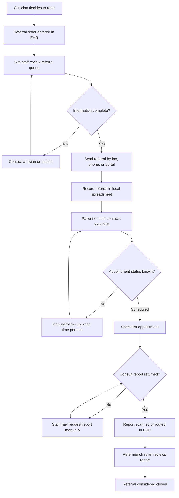

# Current-State Referral Workflow

## Project

**Closed-Loop Specialty Referral Management: Healthcare SaaS Implementation and Analytics**

## Purpose

This document describes how NorthStar Medical Group currently manages specialty referrals before implementation of the proposed referral-management solution. The workflow is fictional but designed to reflect credible operational problems in a multi-site ambulatory organization.

## Current-State Summary

NorthStar's six primary-care sites initiate referrals in the EHR, but much of the downstream work occurs through site-specific work queues, telephone calls, fax, email, spreadsheets, and staff memory. Referral ownership, statuses, escalation practices, and closure requirements differ across sites.

No single system reliably shows whether a referral:

- Contains the information needed by the specialist
- Has been assigned to a referral coordinator
- Has reached the patient
- Has been scheduled
- Has resulted in a completed appointment
- Is awaiting a specialist report
- Has been clinically closed

## Current-State Workflow Diagram

## Detailed Workflow

### 1. Referral Initiation

1. A primary-care clinician determines that specialty evaluation is needed.
2. The clinician or support staff creates a referral order in the EHR.
3. Clinical reason, diagnosis, specialty, priority, insurance information, and supporting documents may be entered inconsistently.
4. The referral enters a site-specific EHR queue.

**Observed weaknesses**

- Required information varies by site and specialty.
- Free-text entries make prioritization and reporting difficult.
- Routine and urgent referrals may appear in the same queue.
- The ordering clinician may assume submission means the referral is being actively managed.

### 2. Intake Review

1. A referral coordinator reviews the site's queue.
2. The coordinator determines whether the referral contains sufficient information.
3. Missing information is requested from the clinician, patient, payer, or medical-record staff.
4. Follow-up may occur through EHR messages, email, telephone calls, handwritten notes, or spreadsheet comments.

**Observed weaknesses**

- There is no uniform completeness checklist.
- Missing-information requests do not have a consistent status or owner.
- Repeated checks and messages create preventable rework.
- Queue aging may continue without visible escalation.

### 3. Specialist Selection and Referral Transmission

1. Staff identify a specialist using existing lists, payer directories, patient preference, or prior experience.
2. Staff attempt to verify participation, location, availability, and submission requirements.
3. Referral information is transmitted by fax, telephone, external portal, or occasionally electronic exchange.
4. Fax confirmation or portal submission may be retained locally.

**Observed weaknesses**

- Specialist directories may be outdated.
- Transmission methods and confirmation practices vary.
- A successful fax transmission does not confirm clinical acceptance.
- There is limited visibility when a specialist rejects or cannot schedule the referral.

### 4. Patient Outreach and Scheduling

1. Either NorthStar staff, the specialist's office, or the patient is expected to arrange the appointment.
2. Referral coordinators may call the patient and document attempts in the EHR or spreadsheet.
3. The number and timing of outreach attempts differ across sites.
4. If the patient reports an appointment date, staff manually update the tracking record.

**Observed weaknesses**

- Responsibility for scheduling is ambiguous.
- Contact attempts are not consistently structured or countable.
- Patient communication preferences are not always visible.
- Staff cannot distinguish “not yet contacted” from “unable to reach.”
- There is no reliable escalation for urgent unscheduled referrals.

### 5. Appointment Outcome Tracking

1. Staff may learn that an appointment was completed through the patient, specialist, incoming report, or manual follow-up.
2. Cancellations and no-shows may not be communicated to the referring practice.
3. Staff update the EHR or spreadsheet when information becomes available.

**Observed weaknesses**

- Scheduled appointments may be mistaken for completed referrals.
- Appointment outcomes are incomplete and delayed.
- Multiple staff may contact the same patient or specialist.
- Leadership cannot reliably calculate scheduling, completion, cancellation, or no-show rates.

### 6. Consultation Report Receipt

1. The specialist transmits a consultation report by fax, electronic exchange, portal, or mail.
2. Health information management or site staff scan, index, and route the report.
3. The referring clinician reviews the report and determines next steps.
4. When no report arrives, a coordinator may call or fax the specialist for it.

**Observed weaknesses**

- Report receipt is not consistently linked to the original referral.
- Completed visits awaiting reports do not form a reliable work queue.
- Staff may not know whether the visit occurred or whether only the report is missing.
- There is no standard report-turnaround service level.

### 7. Referral Closure

1. Sites use different interpretations of “closed.”
2. Some close the referral when it is sent, some when it is scheduled, and others after the consultation report is received.
3. Non-completed referrals may lack a standardized closure reason.

**Observed weaknesses**

- Closure rates are not comparable across sites.
- A technically closed record may not represent completed care.
- Referral leakage cannot be distinguished from legitimate non-completion.
- Auditability and accountability are limited.

## Current Systems and Information Channels

| System or channel | Current use | Limitation |
|---|---|---|
| EHR referral order | Initiates referral and stores clinical information | Limited downstream status visibility |
| Site EHR work queue | Lists referrals requiring staff attention | Queue definitions and usage vary by site |
| Local spreadsheet | Tracks calls, dates, specialist details, and notes | Version control, duplication, inconsistent fields, limited auditability |
| Fax | Sends referral packets and receives reports | Transmission does not confirm acceptance or completion |
| Telephone | Patient outreach and specialist follow-up | Outcomes are documented inconsistently |
| External specialist portal | Submits or checks some referrals | Multiple portals and no consolidated view |
| Email or EHR messaging | Requests missing information | Difficult to connect messages to a standardized referral stage |
| Scanned documents | Stores returned reports | Report may not be reliably matched to the originating referral |

## Current-State Roles and Handoffs

| From | To | Information transferred | Common failure |
|---|---|---|---|
| Referring clinician | Referral coordinator | Order, clinical reason, priority, supporting records | Incomplete or ambiguous information |
| Referral coordinator | Specialist office | Referral packet and patient information | Missing documents, failed transmission, or rejection |
| Referral coordinator | Patient | Specialist information and scheduling instructions | Patient cannot be reached or responsibility is unclear |
| Specialist office | Patient | Appointment options and preparation instructions | Outcome not returned to NorthStar |
| Specialist office | NorthStar | Appointment result and consultation report | Delayed, missing, or unmatched report |
| Referral coordinator | Referring clinician | Status or missing-information request | Update is delayed or buried in messaging |

## Root-Cause Categories

| Category | Representative causes |
|---|---|
| Process | Different site procedures, unclear ownership, inconsistent closure rules |
| People | Competing workload, variable training, dependence on individual memory |
| Technology | Disconnected queues, spreadsheets, portals, fax, limited interoperability |
| Data | Missing fields, free text, outdated specialist information, inconsistent status values |
| Measurement | Undefined denominators, incomplete timestamps, no authoritative data source |
| External dependency | Specialist availability, payer network rules, patient responsiveness, report-return delays |

## Current-State Risks

1. Urgent referrals may not receive timely follow-up.
2. Patients may experience delays or abandon the referral process.
3. Clinicians may lack specialist findings needed for subsequent care.
4. Staff may duplicate outreach or manually rework incomplete referrals.
5. Leadership may act on incomplete or incomparable metrics.
6. Referral records may be administratively closed before the clinical loop is complete.
7. Manual tools may limit auditability and continuity during staff absence or turnover.

## Current-State Measurement Gaps

NorthStar cannot reliably calculate:

- The percentage of referrals complete at intake
- Time from referral receipt to initial patient contact
- Time from referral receipt to scheduled appointment
- Percentage of patients successfully scheduled
- Appointment completion, cancellation, and no-show rates
- Time from completed appointment to consult-report receipt
- Percentage of qualifying referrals reaching closed-loop completion
- Open-referral aging by workflow stage
- Referral leakage by site, specialty, payer, provider, or reason
- Staff workload and queue ownership

## Problems the Future-State Design Must Solve

The future-state solution must:

1. Establish one enterprise referral-status model.
2. Enforce or identify required intake information.
3. Assign every active referral to a responsible queue or owner.
4. Separate routine, urgent, and overdue work.
5. Record structured outreach attempts and outcomes.
6. Distinguish scheduled appointments from completed encounters.
7. Track report receipt separately from visit completion.
8. Define acceptable completed and non-completed closure paths.
9. Preserve a timestamped status history.
10. Provide actionable operational queues and validated KPIs.
11. Support mixed electronic and manual communication channels.
12. Preserve transparent human review and escalation for clinical priority.

## Discovery Assumptions Requiring Validation

The following would require confirmation during a real client discovery process:

- Which fields are mandatory by specialty
- Who owns patient scheduling for each specialist relationship
- How urgent referrals are clinically defined
- Current outreach-attempt policies
- Whether appointment data are electronically available
- Which specialist reports can be matched automatically
- Existing patient-consent and communication-preference rules
- Current EHR interface and export capabilities
- Site-specific staffing capacity and queue volumes
- Acceptable service levels for each referral stage

## Portfolio Transparency Note

NorthStar Medical Group, its workflow, and all findings are fictional. The analysis demonstrates a realistic discovery and workflow-documentation method and does not claim direct observation of an actual client operation.
