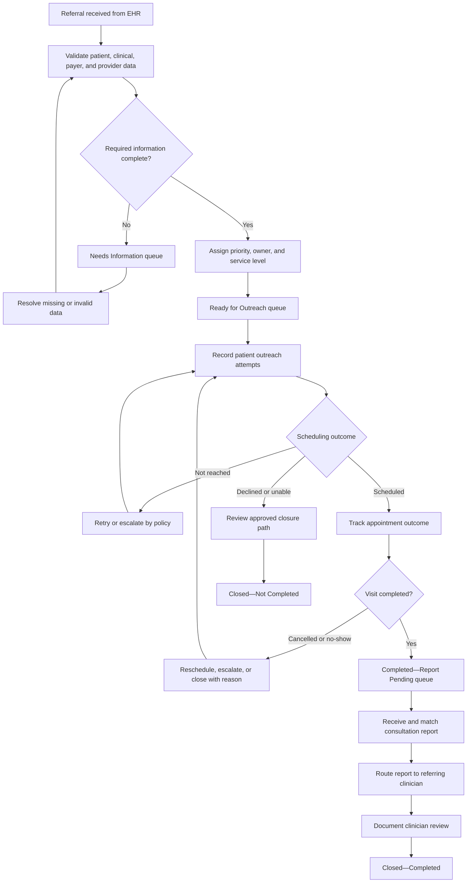

# Future-State Referral Workflow

## Project

**Closed-Loop Specialty Referral Management: Healthcare SaaS Implementation and Analytics**

## Purpose

This document defines the proposed referral workflow after implementation of NorthStar Medical Group's simulated referral-management SaaS solution. It translates the current-state problems into standardized workflow stages, ownership rules, validation controls, work queues, escalations, and closure criteria.

## Future-State Design Principles

1. Every active referral has a visible status and accountable owner or queue.
2. Required information is validated before routine scheduling work begins.
3. Urgent and overdue referrals are visibly prioritized.
4. Outreach attempts and outcomes use standardized values.
5. A scheduled appointment is not treated as completed care.
6. Visit completion and consultation-report receipt are tracked separately.
7. Closed-loop completion requires documented clinical communication.
8. Non-completed referrals require an approved closure reason.
9. Every material status change receives a timestamp and user or source attribution.
10. Operational queues support action; dashboards support oversight and improvement.
11. Automation routes and prioritizes work but does not replace clinical judgment.
12. Manual and external communication channels remain traceable within one workflow.

## Future-State Workflow Diagram

## Workflow Stages

### 1. Referral Received

**Trigger:** A new referral order arrives through an EHR export or representative FHIR transaction.

**System actions:**

- Create a unique referral record.
- Preserve the source referral identifier.
- Record source system, received timestamp, referring clinician, site, specialty, and stated priority.
- Check for possible duplicate active referrals.
- Set initial status to `Received`.

**Owner:** Automated intake process, with exceptions assigned to the referral intake queue.

**Exit criterion:** Referral proceeds to structured intake validation.

### 2. Intake Validation

The solution validates configurable requirements, including:

- Patient identifier and contact details
- Communication preference when available
- Referring clinician and location
- Requested specialty or service
- Clinical reason or diagnosis
- Priority
- Payer and coverage information
- Required supporting documents
- Specialist or destination when already selected

**Complete referral:** Route to prioritization and assignment.

**Incomplete or invalid referral:** Set status to `Needs Information`, record structured validation failures, assign an owner, and create a due date.

**Exit criterion:** All blocking validation failures are resolved or an authorized override is documented.

### 3. Prioritization and Assignment

The platform applies approved operational rules based on:

- Clinically assigned priority
- Requested specialty
- Referring site
- Patient risk or defined escalation indicator
- Referral age
- Payer or network workflow
- Staff queue responsibility

The system does not independently determine clinical urgency. It preserves the clinician's priority and highlights conflicts or missing priority values for review.

**Owner:** Assigned referral coordinator or specialty queue.

**Exit criterion:** Referral has a valid priority, owner, service-level due date, and status of `Ready for Outreach`.

### 4. Patient Outreach

Coordinators record every outreach attempt using standardized fields:

- Attempt timestamp
- Communication channel
- Outcome
- Staff member
- Contacted party
- Next-action date
- Free-text note when needed

Example outcomes include:

- Patient reached
- Voicemail left
- No answer
- Invalid contact information
- Patient requested callback
- Patient declined
- Already scheduled
- Interpreter or accessibility support needed

**Control:** The platform calculates the number of attempts, time since the last attempt, and next required action.

**Exit criterion:** Referral is scheduled, enters an approved non-completion review, or remains in outreach with a valid next action.

### 5. Scheduling

Once an appointment is scheduled, staff record:

- Specialist or organization
- Appointment date and time
- Location or telehealth indicator
- Scheduling source
- Confirmation status
- Relevant preparation instructions

The status becomes `Scheduled`; scheduling does not close the referral.

**Control:** Appointments approaching or passing their dates require an outcome.

**Exit criterion:** Appointment outcome is recorded as completed, cancelled, no-show, rescheduled, or unknown.

### 6. Appointment Outcome

| Outcome | Required next action |
|---|---|
| Completed | Move to `Completed—Report Pending` |
| Cancelled | Determine whether to reschedule, escalate, or close with an approved reason |
| No-show | Initiate defined re-engagement and clinical-escalation process |
| Rescheduled | Update appointment and retain history |
| Unknown | Place in appointment-verification queue |

**Control:** An elapsed appointment cannot remain indefinitely without a documented outcome.

### 7. Consultation Report Follow-Up

After a completed visit, the referral enters `Completed—Report Pending`.

The solution tracks:

- Encounter-completion date
- Expected report date
- Report-request attempts
- Report received timestamp
- Report source and document identifier
- Match confidence or manual matching indicator
- Routing to referring clinician
- Clinician review or acknowledgement

**Control:** Missing reports enter a stage-specific aging queue and escalate according to the approved service level.

**Exit criterion:** The report is matched to the referral, routed to the appropriate clinician, and required review is documented.

### 8. Referral Closure

#### Closed—Completed

Requires:

1. The specialist encounter was completed.
2. The consultation report was received and linked to the referral.
3. The report was routed to the referring clinician.
4. Required clinician review or acknowledgement was recorded.

#### Closed—Not Completed

Requires an approved reason, such as:

- Patient declined after documented outreach
- Patient selected another provider and completion was verified
- Referral no longer clinically indicated after clinician review
- Patient moved or transferred care
- Duplicate referral
- Insurance or access barrier escalated and dispositioned
- Unable to contact after the approved outreach protocol and clinical review
- Other authorized reason with explanatory documentation

#### Cancelled

Used for orders withdrawn by an authorized user or entered in error. Cancellation is distinguishable from failure to complete the referral.

## Future-State Status Model

| Status | Responsible owner | Entry condition | Exit condition |
|---|---|---|---|
| Received | Intake queue | Referral created | Validation begins |
| Needs Information | Assigned intake coordinator | Blocking validation failure | Required information resolved or override approved |
| Ready for Outreach | Referral coordinator | Validation passed and assignment completed | First outreach attempt recorded |
| Outreach in Progress | Referral coordinator | Outreach initiated | Scheduled or approved disposition review |
| Scheduled | Referral coordinator | Appointment documented | Appointment outcome recorded |
| Completed—Report Pending | Report follow-up queue | Visit completed | Report received, routed, and reviewed |
| Closed—Completed | No active owner | Closed-loop criteria satisfied | Terminal status |
| Closed—Not Completed | No active owner | Authorized non-completion disposition approved | Terminal status |
| Cancelled | No active owner | Order withdrawn or entered in error | Terminal status |

## Valid Status Transitions

| From | Permitted next status |
|---|---|
| Received | Needs Information; Ready for Outreach; Cancelled |
| Needs Information | Ready for Outreach; Closed—Not Completed; Cancelled |
| Ready for Outreach | Outreach in Progress; Scheduled; Closed—Not Completed; Cancelled |
| Outreach in Progress | Scheduled; Closed—Not Completed; Cancelled |
| Scheduled | Outreach in Progress; Completed—Report Pending; Closed—Not Completed; Cancelled |
| Completed—Report Pending | Closed—Completed; Closed—Not Completed |
| Closed—Completed | None without an authorized reopen action |
| Closed—Not Completed | None without an authorized reopen action |
| Cancelled | None without an authorized reopen action |

## Operational Work Queues

| Queue | Inclusion logic | Default prioritization |
|---|---|---|
| New Intake | Newly received referrals awaiting validation | Priority, then received timestamp |
| Needs Information | Referrals with unresolved blocking validation failures | Urgency, due date, oldest referral |
| Ready for Outreach | Complete referrals without a first outreach attempt | Urgency, service-level due date |
| Outreach Follow-Up | Active referrals with a required next contact action | Overdue next action, urgency, attempt count |
| Appointment Verification | Elapsed appointments without a final outcome | Appointment date, urgency |
| Report Pending | Completed visits without a received and matched report | Report due date, urgency |
| Urgent Escalations | Urgent referrals approaching or exceeding stage service levels | Most overdue first |
| Unassigned Referrals | Active referrals without a valid owner or queue | Urgency, age |
| Data Exceptions | Interface, matching, or data-integrity failures | Severity, received timestamp |

## Preliminary Service-Level Rules

These values are implementation assumptions for testing and will require clinical and operational approval in a real project.

| Workflow event | Routine | Urgent |
|---|---:|---:|
| Intake validation completed | Within 2 business days | Same business day |
| Initial outreach attempted | Within 3 business days after validation | Same or next business day |
| Unresolved missing information escalated | After 5 business days | After 1 business day |
| Unscheduled referral escalated | After 10 business days | After 2 business days |
| Elapsed appointment outcome verified | Within 3 business days | Within 1 business day |
| Missing consultation report escalated | 7 business days after completed visit | 3 business days after completed visit |

## Escalation Logic

A referral should enter an escalation queue when any of the following occurs:

- Urgent referral has no assigned owner.
- Intake, outreach, scheduling, appointment verification, or report follow-up exceeds its service level.
- Contact information is invalid and no alternative contact path is documented.
- Multiple outreach attempts fail under the approved policy.
- Patient reports worsening symptoms or a new concern requiring clinical review.
- Specialist rejects the referral without an alternative plan.
- Required report remains unavailable after defined follow-up attempts.
- Interface or matching failure prevents safe processing.

Clinical concerns route to an authorized clinical reviewer rather than being resolved solely through automated logic.

## Roles and Permissions Concept

| Role | Representative permissions |
|---|---|
| Referral Coordinator | View assigned referrals; update outreach, scheduling, and operational statuses |
| Referral Manager | Reassign work, monitor queues, approve selected dispositions, review escalations |
| Referring Clinician | View referral progress, respond to clinical-information requests, review reports |
| Practice Manager | View site operations and aggregate performance |
| Medical Director | Review clinical escalations and approve clinical workflow rules |
| Health IT Support | Monitor interfaces and correct authorized technical exceptions |
| Data Analyst | Access approved analytical datasets and metric outputs |
| System Administrator | Configure reference data, roles, queues, and service-level rules |
| Auditor/Compliance | Read-only access to authorized audit and workflow history |

Final permissions will follow minimum-necessary access and require formal privacy and security review.

## Automation and Human Review

### Appropriate automation

- Required-field validation
- Duplicate-candidate identification
- Queue routing
- Service-level due-date calculation
- Aging and overdue flags
- Reminders and escalation creation
- Data reconciliation and dashboard refresh

### Required human judgment

- Assigning or changing clinical urgency
- Determining whether a patient-reported concern needs clinical review
- Approving selected non-completion closure reasons
- Resolving ambiguous patient, provider, referral, or report matches
- Deciding whether a referral remains clinically appropriate
- Authorizing exceptions to required documentation or workflow rules

## Proposed Data Capture

The future-state process introduces structured timestamps for:

- Referral received
- Validation completed
- Missing information requested and resolved
- Assignment
- Each outreach attempt
- Appointment scheduled
- Appointment completed, cancelled, or missed
- Consultation report requested and received
- Report routed and reviewed
- Referral closed

These timestamps support reproducible operational metrics and stage-level aging.

## Expected Operational Benefits

The design is intended to support:

- Clear referral ownership
- Earlier detection of incomplete referrals
- Faster identification of urgent and overdue work
- Less duplicate outreach and manual reconciliation
- Consistent appointment-outcome tracking
- Reliable report-follow-up queues
- Comparable metrics across sites and specialties
- Better auditability and continuity during staff absence
- More defensible closed-loop measurement

These are design objectives, not measured real-world outcomes.

## Traceability to Current-State Problems

| Current-state problem | Future-state control |
|---|---|
| Inconsistent required information | Configurable intake-validation rules |
| Unclear ownership | Required owner or accountable queue |
| Urgent referrals mixed with routine work | Priority-specific queues and service levels |
| Unstructured outreach documentation | Standard outreach attempt and outcome fields |
| Scheduling mistaken for completion | Separate scheduled and completed statuses |
| Missing appointment outcomes | Appointment-verification queue |
| Reports not linked to referrals | Referral-report matching and exception workflow |
| Different closure definitions | Standard completed and non-completed closure criteria |
| Spreadsheet-based tracking | Consolidated status history and work queues |
| Inconsistent metrics | Governed definitions, timestamps, and validation queries |

## Acceptance Criteria for Workflow Design

The future-state workflow is acceptable when:

1. Every active referral has an owner or accountable queue.
2. Every status has a documented entry and exit condition.
3. Invalid status transitions can be rejected or flagged.
4. Urgent and overdue referrals are operationally distinguishable.
5. Missing information, outreach, appointments, and reports each have defined exception paths.
6. Scheduled, completed, and closed referrals cannot be confused.
7. Completed closure requires report receipt and documented routing or review.
8. Non-completed closure requires an approved reason.
9. Each KPI can be derived from captured fields and timestamps.
10. Clinical decisions remain subject to authorized human review.

## Portfolio Transparency Note

NorthStar Medical Group, the proposed solution, workflow rules, and service levels are fictional. They demonstrate a realistic healthcare SaaS implementation approach and do not represent a production implementation or validated clinical protocol.
