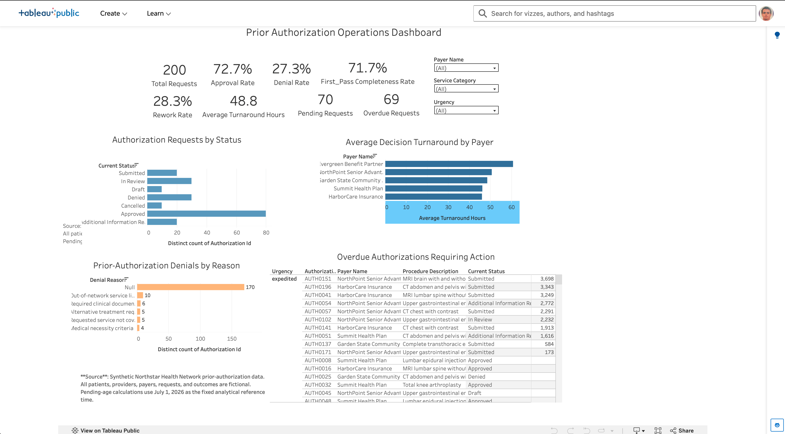

# Healthcare Data Analytics Portfolio

This repository contains a growing collection of healthcare analytics and data engineering projects focused on SQL, data quality, revenue-cycle operations, interoperability, and operational reporting.

## Completed Projects

### Project 1 — Healthcare SQL Data Quality

Applies MySQL validation rules to identify missing patient identifiers, duplicate encounters, invalid dates, negative charges, and other exceptions that can undermine healthcare reporting and downstream analytics.

[View Project 1](Project_1_Healthcare_SQL_Data_Quality/README.md)

### Project 2 — Healthcare Revenue Cycle Analytics

Builds and analyzes a relational healthcare revenue-cycle database containing patients, providers, insurance plans, claims, and payments. The project examines claim status, denials, billed and allowed amounts, payer and provider performance, submission lag, reimbursement, and reusable reporting through SQL views.

[View Project 2](Project_2_HC_Revenue_Cycle/README.md)

### Project 3 — Healthcare Prior Authorization Workflow and FHIR API Integration

An end-to-end healthcare interoperability and operational analytics project for a fictional health network. I generated and validated synthetic prior-authorization data, designed a MySQL relational model, created connected FHIR R4–aligned transaction bundles, tested REST API requests in Postman, calculated operational KPIs, and built an interactive Tableau dashboard with an actionable overdue work queue.

**Highlights**

- Generated 200 synthetic authorization requests and 728 status-history events
- Modeled `Patient`, `Practitioner`, `Organization`, `Coverage`, `ServiceRequest`, `Claim`, `ClaimResponse`, and `Task` resources
- Built MySQL validation, analytical views, and KPI queries
- Measured approval, denial, first-pass completeness, rework, turnaround, pending volume, and SLA performance
- Published an interactive Tableau operations dashboard
- Used synthetic data only; no PHI is included

**Technology:** Python, MySQL, HL7 FHIR R4, JSON, REST APIs, Postman, Tableau Public, Git, and GitHub

[View the project files](Project_3_Healthcare_Prior_Authorization_FHIR) · [Open the live Tableau dashboard](https://public.tableau.com/app/profile/brandon.mcdermott/viz/HealthcarePriorAuthorizationOperationsDashboard/PriorAuthorizationOperationsDashboard)



## Repository Structure

```text
Healthcare_Portfolio/
├── README.md
├── Project_1_Healthcare_SQL_Data_Quality/
│   ├── README.md
│   ├── Healthcare_Data_Quality_Checks.sql
│   └── images/
├── Project_2_HC_Revenue_Cycle/
│   ├── README.md
│   ├── claim_revenue_cycle.sql
│   ├── healthcare_revenue_cycle.sql
│   ├── Healthcare_Revenue_Cycle.vuerd.json
│   └── images/
└── Project_3_Healthcare_Prior_Authorization_FHIR/
    ├── README.md
    ├── dashboard/
    │   └── Dashboard_URL.md
    ├── data/
    │   ├── fhir/
    │   ├── processed/
    │   │   └── authorization_operations.csv
    │   └── source/
    ├── docs/
    │   ├── data_dictionary.md
    │   ├── fhir_mapping.md
    │   ├── project_charter.md
    │   ├── requirements.md
    │   └── workflow_analysis.md
    ├── images/
    ├── postman/
    │   └── Project 3 — FHIR Prior Authorization API.postman_collection.json
    ├── python/
    │   ├── generate_fhir_bundles.py
    │   ├── generate_synthetic_data.py
    │   ├── validate_fhir_bundles.py
    │   └── validate_synthetic_data.py
    └── sql/
        ├── authorization_analytics.sql
        ├── create_database.sql
        ├── HC_Prior_Auth_FHIR.sql
        └── post_import_validation.sql
```

## Tools and Methods

- MySQL and MySQL Workbench
- SQL joins, aggregations, conditional logic, common table expressions, and window functions
- Data-quality validation and exception reporting
- Healthcare claims and revenue-cycle analytics
- Relational database design and ERD documentation
- KPI development and business-impact interpretation
- FHIR R4 mapping, API testing, and Tableau dashboard development

Future healthcare analytics projects will be added as additional numbered project directories.
